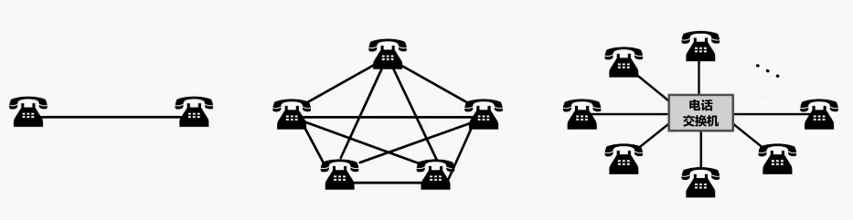
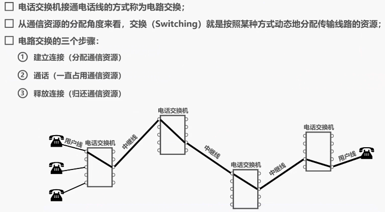
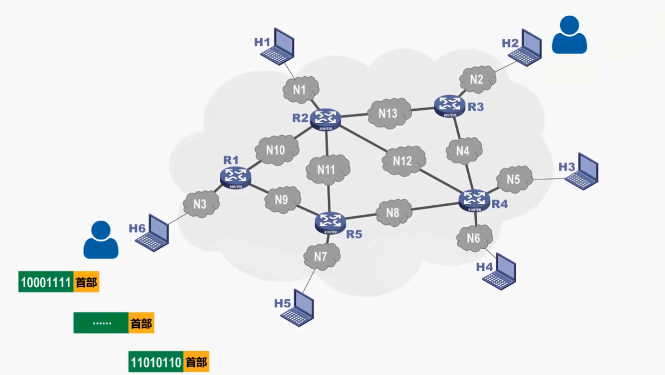
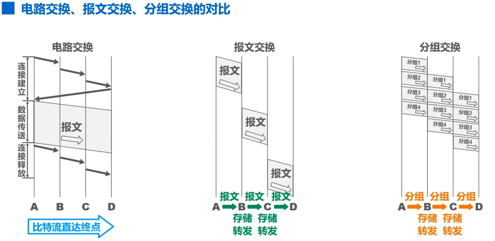
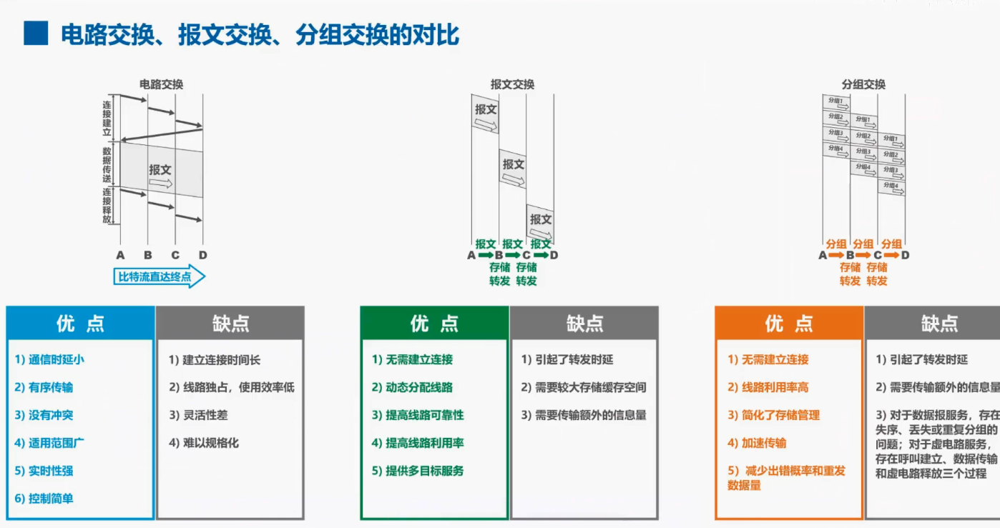

## 1.3 三种交换方式
本节课我们介绍三种交换方式，分别是电路交换（Circuit Switching），分组交换（Packet Switching）以及报文（Message Switching）交换。

**1. 电路交换 (Circuit Switching)**

我们首先来看电路交换，在电话问世后不久，人们就发现要让所有的电话机都两两相连接是不现实的。例如两部电话只需要用一对电线就能够互相连接起来，但若有 5 部电话要两两相连，则需要 10 对电线。当电话机的数量很大时，这种连接方法需要的电线数量就太大了。例如如果有 N 部电话机需要两两相连，那么一共需要多少吨电线？答案是 N * (N-1)/2。

于是人们认识到,要使得每一部电话能够很方便的和另一部电话进行通信，就应当使用一个中间设备，将这些电话连接起来。这个中间设备就是电话交换机，每一部电话都连接到电话交换机上，可以把电话交换机简单的看成是一个有多个开关的开关器，可以将需要通信的任意两部电话的电话线路按需接通，从而大大减少了连接的电话线数量。

当电话机的数量增多时，就需要使用很多彼此连接起来的电话交换机来完成全网的交换任务，用这样的方法就构成了覆盖全世界的电信网，电话交换机接通电话线的方式称为电路交换。从通信资源的分配角度来看，交换就是按照某种方式动态的分配传输线路的资源。

我们来看下面这个电路交换的示意图，为了简单起见，图中没有区分市话交换机和长途电话交换机。应当注意的是用户线归电话用户专用，而电话交换机之间拥有的大量话路的中继线，则是许多用户共享的。电路交换有以下三个步骤：
- 第一步是建立连接，也就是分配通信资源。例如在使用电路交换打电话之前，必须先拨号请求建立连接，当被叫用户听到电话交换机送来的拨号音并摘机后，从主叫端到被叫端就建立了一条连接，也就是一条专用的物理通路，这条连接保证了双方通话时所需的通信资源，而这些资源在双方通信时不会被其他用户占用。
- 第二步是通话，也就是主教和被教双方互相通电话，在整个通话期间，第一步建立连接所分配的通信资源始终被占用。
- 第三步是释放连接，也就是通话完毕挂机后，电话交换机释放刚才使用的这条专用的物理通路。换句话说是把刚才占用的所有通信资源归还给电信网。

**2. 分组交换（Packet Switching)**

因此计算机网络通常采用分组交换，而不是电路交换。假设这是因特网的一部分，在因特网中最重要的分组交换机就是路由器，他负责将各种网络互联起来，并对接收到的分组进行转发，也就是在进行分组交换。

我们来看这样一个例子：

假设主机 H6 的用户要给主机 H2 的用户发送一条消息，通常我们把表示该消息的整块数据称为一个报文。

在发送报文之前，先把较长的报文划分成为一个个更小的等长数据段，在每一个数据段前面，加上一些由必要的控制信息组成的首部后，就要构成了一个分组，也可简称为包，相应的首部也可称为包头。

请大家思考一下，添加首部的作用是什么？这不是额外加大了带传输的数据量吗？

实际上首部起到非常关键的作用。相信大家至少能想到首部中肯定包含了分组的目的地址，否则分组传输路径中的各分组交换机，也就是各路由器，就不知道如何转发分组了。

分组交换机收到一个分组后，先将分组暂时存储下来，再检查其首部，按照首部中的目的地址进行查表转发，找到合适的转发接口，通过该接口将分组转发给下一个分组交换机。

在本例中，主机 H6 将所构造出的各分组依次发送出去，各分组经过途中各分组交换机的存储转发，最终到达主机 H2，主机 H2 收到这些分组后，去掉他们的首部，将各数据段组合还原出原始报文。

>需要说明的是，为了初学者容易理解，在本例中，我们只演示出了分组传输过程中的两种情况：

>一种是各分组从源站到达目的站，可以走不同的路径，也就是不同的路由。

>另一种是分组乱序，也就是分组到达目的站的顺序，不一定与分组在源站的发送顺序相同。

>对于可能出现的分组丢失、误码、重复等问题并没有演示，这些内容将在今后的课程中详细介绍。

在上述的分组交换过程中：

- 发送方所要完成的任务是构造分组和发送分组。
- 路由器也就是分组交换机所要完成的任务是缓存分组和转发分组，简称为存储转发。
- 接收方所要完成的任务是接收分组和还原报文。

**3. 报文（Message Switching)**

与分组交换类似，报文交换中的交换节点，也采用存储转发方式，但报文交换对报文的大小没有限制，这就要求交换节点需要有较大的缓存空间。

需要注意的是报文交换主要用于早期的电报、通信网，现在较少使用，通常被较先进的分组交换方式所取代，因此我们不再详细介绍报文交换了。

&nbsp;

**4. 三种交换方式的对比**

接下来我们对电路交换、报文交换、分组交换这三种交换方式进行一下对比。假设 ABCD 是分组传输路径上所要经过的 4 个节点交换机，纵坐标为时间：

* 对于电路交换，通信之前首先要建立连接，连接建立好之后，就可以使用已建立好的连接进行数据传送，数据传送结束后需要释放连接，以归还之前建立连接所占用的通信线路资源，

* 对于报文交换可以随时发送报文，而不需要事先建立连接。整个报文先传送到相邻节点交换机，全部存储下来后进行查表转发，转发到下一个节点交换机，

* 对于分组交换可以随时发送分组，而不需要事先建立连接，构成原始报文的一个个分组，依次在各节点交换机上存储转发，各节点交换机在发送分组的同时，还缓存接收到的分组。

---

* 当使用电路交换时，一旦建立连接中间的各节点交换机就是直通形式的，比特流可以直达终点。

* 当使用报文交换时，整个报文需要在各节点交换机上进行存储转发，由于不限制报文的大小，因此需要各节点交换机都具有较大的缓存空间。

* 当使用分组交换时，构成原始报文的一个个分组，在各节点交换机上进行存储转发，相比报文交换，减少了转发时延，还可以避免过长的报文，长时间占用链路，同时也有利于进行差错控制。

**5. 三种交换方式各自的优缺点**

电路交换方式的优点：

- 第一，通信时延小，这是因为通信线路为通信双方用户专用，数据直达，因此通信时延非常小，当连续传输大量数据时，这一优点非常明显。
- 第二，有序传输，这是因为通信双方之间只有一条专用的通信线路，数据只在这一条线路上传输，因此不存在失序问题。
- 第三，没有冲突，不同的通信双方拥有不同的信道，不会出现征用物理信道的问题。
- 第四，使用范围广，电路交换既适用于传输模拟信号，也适用于传输数字信号。
- 第五，实时性强，这主要得益于其通信时延小的优点。
- 第六，控制简单，电路交换的节点交换机及其控制都比较简单。

电路交换方式的缺点：

- 第一，建立连接时间长，电路交换的平均连接建立时间对计算机通信来说太长了。
- 第二，线路独占，使用效率低，电路交换一旦建立连接，物理通路就被通信双方独占，即使通信线路空闲，也不能供其他用户使用，因而信道利用率很低。
- 第三，灵活性差，只要连接所建立的物理通路中的任何一点出现了故障，就要必须重新拨号建立新的连接，这对十分紧急和重要的通信是很不利的。
- 第四，难以规格化，电路交换时数据直达，不同类型不同规格不同速率的终端，很难相互进行通信，也难以在通信过程中进行差错控制。

---

报文交换的优点如下：

- 第一，无需建立连接，报文交换不需要为通信双方预先建立一条专用的通信线路，不存在建立连接的时延，用户可以随时发送报文。
- 第二，动态分配线路，当发送方把报文传送给节点交换机，时节点交换机先存储整个报文，然后选择一条合适的空闲线路，将报文发送出去。
- 第三，提高线路可靠性。如果某条传输路径发生故障，会重新选择另一条路径传输，数据因此，提高了传输的可靠性。
- 第四，提高线路利用率。通信双方不是固定占用一条通信线路，而是在不同的时间分段部分占用物理线路，因而大大提高了通信线路的利用率。
- 第五，提供多目标服务，一个报文可以同时发送给多个目的地址，这在电路交换中是很难实现的。

报文交换的缺点如下：

- 第一，引起了转发时延，这是因为报文在节点交换机上要经历存储转发的过程。
- 第二，需要较大的存储缓存空间，这是因为报文交换对报文的大小没有限制。
- 第三，需要传输额外的信息量，这是因为报文需要携带目标地址、源地址等信息。

---

分组交换的优点如下，

- 第一，无需建立连接，分组交换不需要为通信双方预先建立一条专用的通信线路，不存在建立连接的时延，用户可以随时发送分组。
- 第二，线路利用率高，通信双方不是固定占用一条通信线路，而是在不同的时间分段部分占有物理线路，因而大大提高了通信线路的利用率。
- 第三，简化了存储管理，这是相对于报文交换而言的，因为分组的长度固定，相应的缓冲区的大小也固定，管理起来相对容易
- 第四，加速传输，由于分组是逐个传输的，这就使得后一个分组的存储操作与前一个分组的转发操作可以同时进行。
- 第五减少出错概率和重发数据量。因为分组比报文小，因此出错概率必然减小。即便分组出错，也只需重传出错的部分，这比重传整个报文的数据量小很多，这样不仅提高了可靠性，也减少了传输时延。

分组交换的缺点如下：

- 第一，引起了转发时延，这是因为分组在节点交换机上要经历存储转发的过程。
- 第二，需要传输额外的信息量，将原始报文分割成等长的数据块，每个数据块都要加上源地址、目的地址等控制信息，从而构成分组，因此使得传送的信息量增大了。
- 第三，当分组交换采用数据报服务时，可能会出现失去丢失或重复分组，分组到达目的节点时，需要重新还原成原始报文，比较麻烦。若分组交换采用虚电路服务，虽然没有分组失序问题，但有呼叫建立数据传输和虚电路释放三个过程。

---

在本节中，介绍了电路交换，分组交换以及报文交换这三种交换方式，其中分组交换是重点内容。
