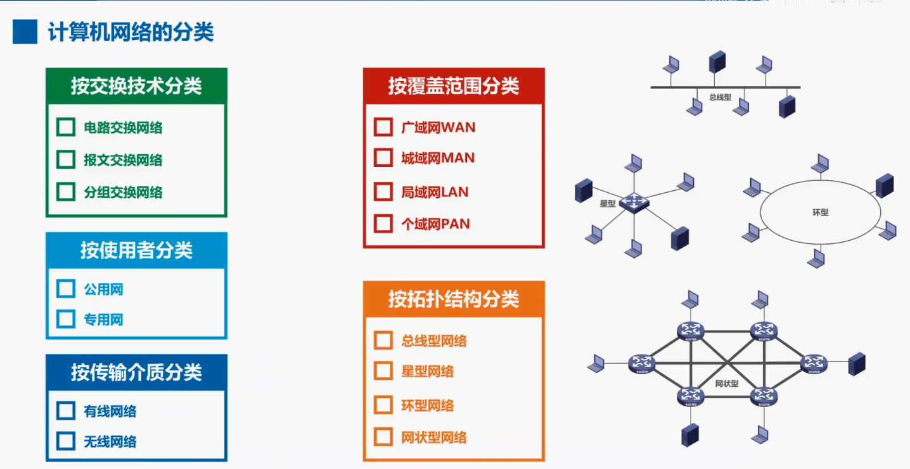

## 1.4 计算机网络的定义和分类

本节介绍计算机网络的定义和分类。

**计算机网络的定义**

首先来看计算机网络的定义：计算机网络的精确定义并未统一，换句话说，全世界没有一个对计算机网络的公认的唯一定义。

这里我们给出一个计算机网络的最简单定义，即计算机网络是一些互相连接的、自治的计算机的集合，我们可以从该定义中找出三个关键词，它们是互联、自治、集合，互联是指计算机之间可以通过有线或无线的方式进行数据通信，自治是指独立的计算机，它有自己的硬件和软件可以单独运行使用。

那么基于以上概念，请大家思考一下该图所示是否是一个计算机网络？很显然这不是计算机网络，因为图中所示的各终端机只是具有显示和输入设备的终端，而并不是自治的计算机。因此这只是一个运行分时系统的大型机系统，集合是指至少需要两台计算机。

**计算机网络的定义**

例如按**交换技术分类:** 可以分为电路交换网络，报文交换网络，分组交换网。

按**网络的使用者分类:** 可以分为公用网，专用网，公用网是指电信公司出资建造的大型网络，公用的意思就是所有愿意按电信公司的规定，缴纳费用的人都可以使用这种网络，因此公用网也可称为公众网。专用网是指某个部门为本单位的特殊业务工作的需要而建立的网络，这种网络不向本单位以外的人提供服务，例如军队、铁路、电力等系统均有本系统的专用网

按**传输介质分类:** 可以分为有线网络和无线网络，有线网络包括双绞线网络、光纤网络等。而无线局域网所使用的 WIFI 技术目前应用比较普遍

按**网络的覆盖范围分类:** 可以分为广域网 WAN，城域网 MAN，局域网 LAN，个域网 PAN，希望大家能记住这几个比较常见的英文缩写词，尤其是 WAN，LAN 和 PAN。您可以看看自己家装路由器背面的各接口，很可能标记为 1 个 WAN 和多个 LAN，而不是标记为中文的广域网接口和局域网接口。

广域网的覆盖范围通常为几十公里到几千公里，可以覆盖一个国家地区，甚至横跨几个州，因而有时也称为远程网。广域网是因特网的核心部分，其任务是为核心路由器提供远距离，例如跨越不同的国家的高速连接，互联分布在不同区域的城域网和局域网

城域网的覆盖范围一般是一个城市，可跨越几个街区，甚至整个城市，其作用距离为 5~50 公里。城域网通常作为城市骨干网，互联大量企业机构和校园局域网，近几年城域网已开始成为现代城市的信息服务基础设施，为大量用户提供接入和各种信息服务，并有趋势将传统的电信服务、有线电视服务和互联网服务融为一体。

局域网一般用微型计算机或工作站通过高速通信线路相连，速率通常在 10 兆比特每秒以上，但地理上则局限在较小的范围内，如一个实验室一幢楼或一个校园内，距离一般在一公里左右，局域网通常由某个单位单独拥有使用和维护。在局域网发展的初期，一个学校或工厂往往只拥有一个局域网，现在局域网已被非常广泛的使用，一个学校或企业大都拥有许多个互联的局域网，这样的网络通常称为校园网或企业网。

个域网是个人区域网络的简称，它不同于上述网络，不是用来连接普通计算机的，而是在个人工作的地方把属于个人使用的电子设备，例如便携式计算机、打印机、鼠标、键盘耳机等，用无线技术连接起来的网络，因此也常称为无线个人区域网 WPAN，其覆盖范围大约为 10 米。

计算机网络还可以按**拓扑结构分类:** 可以分为总线型网络、星型网络、环形网络和网状型网络，总线型网络使用单根传输线，把计算机连接起来。它的优点是建网容易增减节点方便节省线路，缺点是重负载时通讯效率不高，总线任意一处出现故障，则全网瘫痪。

星型网络是将每个计算机都以单独的线路与中央设备相连。中央设备早期是计算机，后来是集线器，现在一般是交换机或路由器，这种网络拓扑便于网络的集中控制和管理，因为端用户之间的通信必须经过中央设备，缺点是成本高，中央设备对故障敏感。

环形网络是将所有计算机的网络接口连接成一个环，最典型的例子是令牌环局域网，环可以是单环，也可以是双环，环中信号是单向传输的，

网状型网络，一般情况下，每个节点至少有两条路径与其他节点相连，多用在广域网中，其优点是可靠性高，缺点是控制复杂，线路成本高。

需要注意的是以上 4 种基本的网络拓扑还可以互联为更复杂的网络。

本节并没有什么难点内容，只需要对这些内容做到了解即可。

