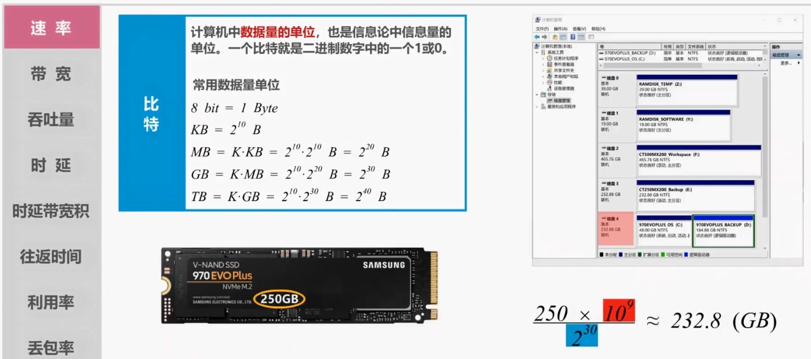
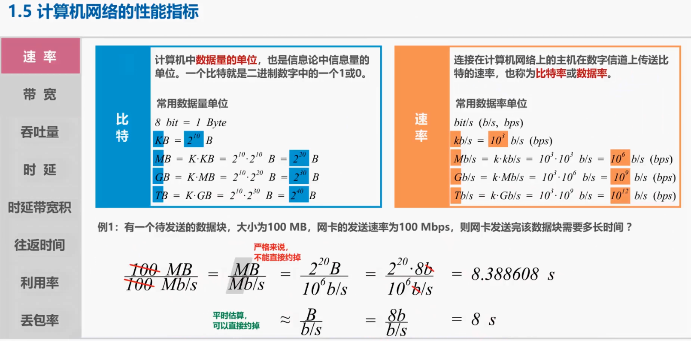
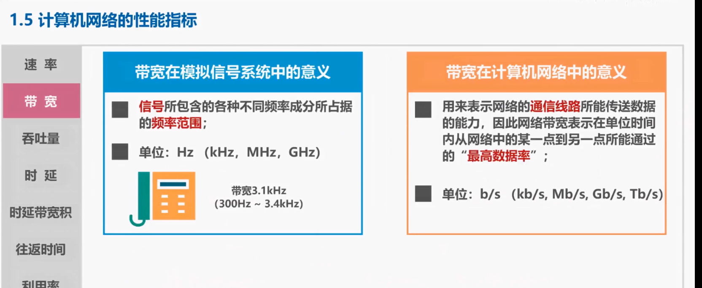
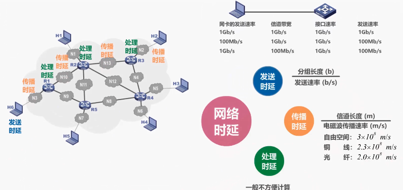
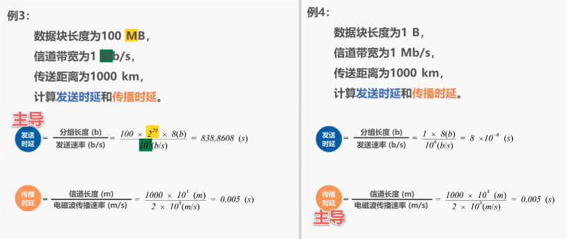
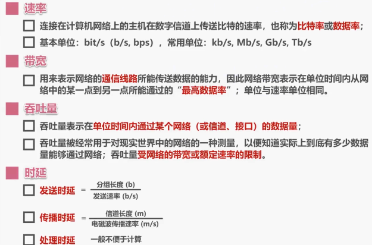
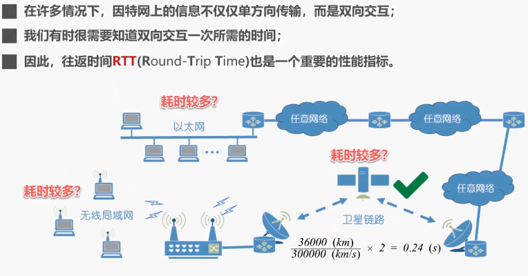
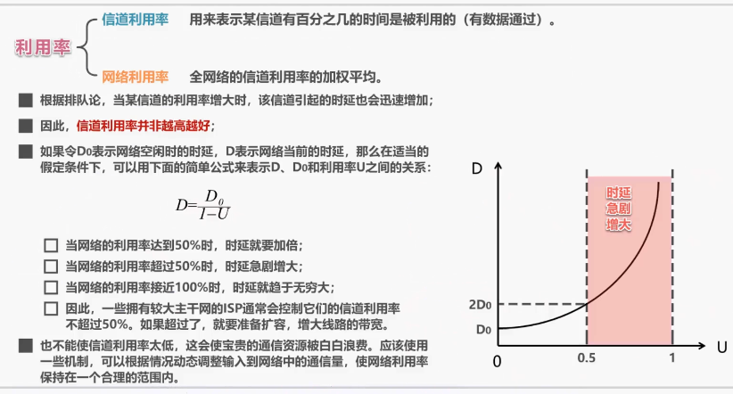

## 1.5 计算机网络的性能指标

本节课我们介绍计算机网络的性能指标，性能指标可以从不同的方面来度量计算机网络的性能。

常用的计算机网络性能指标有 8 个：速率、带宽、吞吐量、时延、时延带宽积，往返时间、利用率，丢包率。

---

**速率**

首先介绍速率。为了能够更好的理解速率，我们需要先了解比特：比特是计算机中数据量的单位，也是信息论中信息量的单位：

- 一个比特就是二进制数字的 1 或 0，常用的数据量单位有字节，它的英文单词为 Byte，常简写为大写字母 B。
- 1 个字节包含 8 个比特，比特的英文单词为 bit，常简写为小写字母 b。
- 千字节 KB，这里的 K 为 2 的 10 次方，因此 KB = 2 的 10 次方个字节。
- 兆字节 MB 它等于 K 乘以 KB，因此等于 2 的二次方个字节；
- 吉字节 GB，它等于 K 乘以 MB，因此等于 2 的 30 次方个字节。
- 太子节 TB 它等于 K 乘以 GB，因此等于 2 的 40 次方个字节。

举例说明，也许大家有购买新硬盘或 U 盘的经历，在使用中会发现操作系统给出的容量与厂家标称的容量不同，例如这是我计算机中的一块固态硬盘，标称容量为 250 GB，但操作系统给出的容量为 232.8 GB，这是什么原因呢？下面的计算公式就要可以说明这个问题，厂家给出的单位 GB 中的 G 为 10 的 9 次，而操作系统中数据量单位 GB 中的 G 为 2 的 30 次。

有了比特的概念，我们就可以引出计算机网络中的一个重要的性能指标：速率。它具体是指连接在计算机网络上的主机，在数字信道上传送比特的速率，也称为比特率或数据率。常用的数据率单位有：

- 比特每秒，可以简写为小写字母 b/s 或者写为 BPS，千比特每妙。这里的 k 常用小写，而数据量单位中的 K 常用大写，小写 k 在速率单位中的值为 10 的三次，也就是 1000，而大写 K 在数据量单位中的值为 2 的 10 次，也就是 1024
- 兆比特每秒，尽管这里的大写字母 M 与数据量单位中的相同，但在速率单位中其值为 10 的 6 次，而在数据量单位中其值为 2~20 次
- 吉比特每秒，尽管这里的大写字母 G 与数据量单位中的相同，但在数据单位中其值为 10 的 9 次，而在数据量单位中其值为 2 的 30 次
- 太比特每秒，尽管这里的大写字母 T 与数据量单位中的相同，但在数据单位中其值为 10 的 12 次，而在数据量单位中其值为 2 的 40 次

【考研 2013 年 35 题】主机甲通过 1 个路由器（存储转发方式）与主机乙互联，两段链路的数据传输速率均为 10 Mbps，主机甲分别采用报文交换和分组大小为 10 kb 的分组交换向主机乙发送 1 个大小为 8 Mb (1Mb=106kb ) 的报文。若忽略链路传播延迟、分组头开销和分组拆装时间，则两种交换方式完成该报文传输所需的总时间分别为 ( )。

A．800ms、1600ms

B．801ms、1600ms

C．1600ms、800ms

D．1600ms、801ms

- 发送一个报文的时延是 8 Mb / 10 Mb/s = 800ms，在接收端接收此报文的时延也是 800ms，共计 1600ms。 即发送时延 + 传播时延
- 发送一个报文的时延是 10kb / 10 Mb/s = 1ms，接收一个报文的时延也是 1 ms，但是在发送第二个报文时，第一个报文已经开始接收。共计有 800 个分组，总时间为 801ms。
- 分组为 10kb，发第一条的时候，路由器端在等待，第二条开始甲机和路由器可以同时运行，甲机发送完后停止，路由器传最后一条。用时 800ms + 1ms

---

**带宽**

接下来我们介绍带宽性能指标。

带宽在模拟信号系统中的意义是指信号所包含的各种不同频率成分所占据的频率范围，其基本单位是赫兹，常用单位有千赫兹、兆赫兹、吉赫兹，例如在传统的通信线路上传送的电话信号的标准带宽为 3.1k 赫兹，范围从 300Hz 到 3.4kHz，这是话音的主要成分的频率范围。

带宽在计算机网络中的意义是用来表示网络的通信线路所能传送数据的能力，因此网络带宽表示在单位时间内，从网络中的某一点到另一点所能通过的最高数据率。因此带宽计算机网络性能指标的单位与我们刚刚介绍的速率性能指标的单位是相同的，基本单位是比特每秒，常用单位有千比特每秒，兆比特每秒，吉比特每秒，太比特每秒，

大家可能有过这样的经历，有朋友问你家的出口网速有多大？你可能回答说 200 兆，这里我们往往省略说比特每秒。完整的描述应该是最高速率为 200 兆比特每秒，而这个最高速率其实就是你家网络的出口带宽，这当然是一个很重要的计算机网络性能指标，它直接关系到我们的网络应用体验。

我们介绍了带宽的两种描述，其实带宽的这两种表述之间有着密切的联系，一条通信线路的频带宽度越宽，其所能传输数据的最高数据率也就越高。

---

**吞吐量**

接下来我们介绍吞吐量性能指标，吞吐量表示在单位时间内，通过某个网络或信道接口的数据量，吞吐量被经常用于对现实世界中的网络的一种测量，以便知道实际上到底有多少数据量能够通过网络。吞吐量受网络带宽或额定速率的限制。例如这是一个带宽为 1G 比特每秒的以太网，其吞吐量受带宽限制，最高为 1G 比特每秒，通常只能达到 700 兆比特每秒.

---

**时延**

接下来，我们介绍时延。我们来看看分组从源主机传送给目的主机的过程中，都会在哪些地方产生时延：

- 源主机将分组发往传输线路，这需要花费一定的时间，我们把这段时间称为发送时延
- 代表分组的电信号，在链路上传输，这也需要花费一定的时间。我们把这段时间称为传播时延
- 路由器收到分组后，对其进行存储转发，这也需要花费一定的时间，我们把这段时间称为处理时延

一般来说，源主机和目的主机之间的路径会由多段电路和多个路由器构成，因此会有多个传播时延和处理时延

通过本例可知，网络时延由三部分构成，他们是发送时延，传播时延和处理时延，发送时间的计算公式为分组长度除以发送速率，这里需要对发送速率做一下说明，如图所示，这是家庭局域网的一部分，网卡的发送速率，信道带宽，交换机的接口速率，他们共同决定着主机的发送速率。例如若网卡的发送速率为 1G 比特每秒，信道带宽为 1G 比特每秒，交换机的接口速率为 1G 比特每秒，则主机的发送速率理论上最大可以达到 1G 比特每秒；

若网卡的发送速率为 100 兆比特每秒，信道带宽为 1G 比特每秒，交换机的接口速率为 1G 比特每秒，则主机的发送速率理论上最大只能达到 100 兆比特每秒；

若网卡的发送速率为 1G 比特每秒，信道带宽为 100 兆比特每秒，交换机的接口速率为 1G 比特每秒，则主机的发送速率理论上最大，也只能达到 100 兆比特每秒；

从该例可以看出，在构建网络时应该做到各设备间以及传输介质的速率匹配，这样才能完全发挥出本应具有的传输性能，希望同学们重视这一点，因为大家今后就可能面临新房装修时，网络布线以及相关设备的采购问题，如果未认真考虑造成网络性能无法满足自己的应用需求，再进行改造，将会是非常麻烦的事情。目前主流的家庭局域网带宽是 1000M 兆，有些发烧友甚至打造家庭万兆局域网。

再来看传播时延的计算公式，由信道长度除以电磁波传播速率，电磁波在自由空间的传播速率是光速，即 3 × 10 的 8 次方米每秒，电磁波在网络传输媒体中的传播速率比在自由空间要略低一些。在铜线电缆中的传播速率约为 2.3 × 10 的 8 次方米每秒，在光纤中的传播速率约为 2.0×10 的 8 次方米每秒。因此要计算传播时延，首先应该确定采用的是什么传输媒体，进而可以确定电磁波在该传输媒体中的传播速率，希望同学们能够将电磁波的上述三种传播速率作为常识而记住。

处理时延没有简单的计算公式，因为它不方便计算，这并不难理解，因为网络中的数据流量是动态变化的，因此路由器的繁忙程度也是动态变化的，另外各种路由器的软硬件性能也可能有所不同，因此很难用一个公式计算出处理时延。

> 这里需要说明的是有的教材中还有一个排队时延，而本课程将排队时延与处理时延合并成为处理时延.

由于处理时延不方便计算，因此一般在有关计算实验的考题中，题目往往会指明处理时延忽略不计。

那么请大家思考一下，在处理时延忽略不计的情况下，网络走时延中，是传播时延占主导，还是发送时延占主导？请大家记好自己的答案，等一下我们看看大家是否做对了。

我们来看这个例子，数据块长度为 100 兆字节，信道带宽为 1M 兆比特每秒，传送距离为 1000 公里，计算发送时延和传播时延。发送时延等于分组长度除以发送速率，将题目给定的相应已知量代入公式。这里 2 的 20 次是数据量单位中的兆，这里 10 的 6 次是速率单位中的兆，计算结果为 800 多秒，传播时延等于信道长度除以电磁波传播速率，将题目给定的相应已知量代入公式，题目并未给出传输介质，为了方便计算，我们假设传输介质是光纤，因此电磁波传输速率这里为 2×10 的 8 次方米每秒，计算结果为 0.005 秒，很显然在本地中发送时延占主导。

再来看另一个例子，本例与例三只有一点不同，就是将数据块的大小从 100 兆字节改为一个字节，我们使用同样的方法可以计算出发送时间为 8×10 的-6 次方秒，传播时延没有改变，仍是 0.005 秒。很显然在本例中传播实验占主导。通过以上两个例子可以看出，构成网络时延的发送时延，传播时延以及处理时延。在处理时延忽略不计的情况下，我们不能想当然的认为发送时延占主导，或传播时延占主导，而应该具体问题具体分析，不知大家是否做对了，如果没做对，请不要灰心。再好好看一下这两个例子，加深理解和记忆。

---

4 个常用的计算机网络性能指标的要点总结如下：

---

&nbsp;
**时延带宽积**

时延带宽积，从字面意思就可以看出，该性能指标是时延与带宽的乘积，但是时延由发送时延，传播时延和处理时延三部分构成。

该性能指标中的时延具体是指哪一个？答案是传播时延。也就是说时延带宽积是传播时延与带宽的乘积，我们可以把传输电路看成是一个管道，其长度为传播时延，横截面积为带宽，则时延带宽积就是该管道的体积，可以想象成管道中充满了比特，若发送端连续发送数据，则在所发送的第一个比特即将到达终点时，发送端就已经发送了时延带宽积个比特。链路的时延带宽积又称为以比特为单位的链路长度。

---

**往返时间**

接下来我们介绍往返时间这个性能指标，在许多情况下，因特网上的信息不仅仅单方向传输，而是双向交互。我们有时很需要知道双向交互一次所需的时间，因此往返时间 RTT 也是一个重要的性能指标。来看下面这个例子，以太网上的某台主机要与无线局域网中的某台主机进行信息交互，往返时间 RTT 是指从源主机发送分组开始，直到源主机收到来自目的主机的确认分组为止，所需要的时间，

请大家根据我们上节课介绍的有关时延的知识来分析一下，分组是在以太网上耗时较多，还是在无线局网上耗时较多，又或者是在卫星链路上耗时较多？答案是卫星链路耗时较多。一般情况下卫星链路的距离比较远，所带来的传播时延比较大，例如地球同步卫星距离地球 36000 公里，那么可以计算出通过同步卫星转发分组所带来的传播时延大约为 240 毫秒。

- - -

**利用率**

接下来我们介绍利用率，性能指标，利用率有两种，一种是信道利用率，另一种是网络利用率。

信道利用率用来表示某信道有百分之几的时间是被利用的，也就是有数据通过，而网络利用率是指全网络的信道利用率加权平均。根据排队论，当某信道的利用率增大时，该信道引起的时延也会迅速增加，因此信道利用率并非越高越好。如果利用 D0 表示网络空闲时的时延，D 表示网络当前的时延，那么在适当的假定条件下，可以利用下面的简单公式来表示 D，D0 和利用率 U 之间的关系。D=D0/(1-U)我们可以按该式画出时延 D，随利用率 U 的变化曲线。可以看出时延 D 从网络空闲时的时延 D0 随利用率优的增加而迅速增长。

当网络的利用率达到 50%，时延就要加倍。当网络的利用率超过 50% 时，时延急剧增大，当网络的利用率接近 100% 时，时延就要趋于无穷大。因此一些拥有较大主干网的 ISP，通常会控制他们的信道利用率不超过 50%，如果超过了就要准备扩容，增大线路的带宽，当然也不能使信道利用率太低，这会使宝贵的通信资源白白浪费。

应该使用一些机制，可以根据情况动态调整输入到网络中的通信量，使网络利用率保持在一个合理的范围内。

- - -

**丢包率**

最后我们来介绍丢包率性能指标，丢包率及分组的丢失率，是指在一定的时间范围内传输过程中丢失的分组数量与总分组数量的比率。丢包率具体可分为接口丢包率、结点丢包率、链路丢包率、路径丢包率、网络丢包率等。丢包率是网络运维人员非常关心的一个网络性能指标，但对于普通用户来说往往并不关心这个指标，因为他们通常意识不到网络丢包。分组丢失主要有两种情况，我们来举例说明，

一种情况是分组在传输过程中出现误码，被结点交换机丢弃如图所示，主机发送的分组在传输过程中出现了误码，当分组进入传输路径中的节点交换机后，被节点交换机检测出了误码，进而被丢弃。至于节点交换机是如何检测出分组有误，我们会在后续课程中介绍。

另一种情况是分组到达一台存储队列已满的分组交换机时被丢弃，在通信量较大时就可能造成网络拥塞，如图所示。假设路由器 r5 当前的输入缓冲区已满，此时主机发送的分组到达该路由器，路由器没有存储空间暂存该分组只能将其丢弃。需要说明的是实际上路由器会根据自身拥塞控制方法，在输入缓存还未满的时候就要主动丢弃分组，因此丢包率反映了网络的拥塞情况，无拥塞时路径丢包率为 0，轻度拥塞时路径丢包率为 1% ~ 4%，严重拥塞时路径丢包率为 5% ~ 15%。当网络的丢包率较高时，通常无法使网络应用正常工作。

- - -

刚刚学的 4 个常用的计算机网络性能指标的要点总结如下：

