## 1.6 计算机体系结构

从本节开始，介绍有关计算机网络体系结构的知识，具体包含以下内容：

- 一，常见的计算机网络体系结构
- 二，计算机网络体系结构分层的必要性
- 三，计算机网络体系结构分层思想举例
- 四，计算机网络体系结构中的专用术语

**常见的计算机网络体系结构**

为了使不同体系结构的计算机网络都能互联，国际标准化组织于 1977 年成立了专门机构研究该问题，不久他们就提出了一个试图使各种计算机在世界范围内互联成网的标准框架，也就是著名的开放系统互联参考模型，简称为 OSI。该模型是一个 7 层协议的体系结构，从下往上依次是物理层、数据链路层、网络层、运输层、会话层、表示层、应用层，它是法律上的国际标准。

到了 20 世纪 90 年代初期，虽然整套的 OSI 国际标准都已经制定出来了，但这时因特网已抢先在全世界覆盖了相当大的范围。因特网从 1983 年开始使用 TCP/IP 协议组，并逐步演变成 TCP/IP 参考模型，该模型是一个 4 层协议的体系结构，从下往上依次是网络接口层，网际层、运输层、应用层，它是事实上的国际标准。

在过去制定标准的组织中，往往以专家学者为主，但现在许多公司都纷纷挤进各种各样的标准化组织，使得技术标准有着浓厚的商业气息。一个新标准的出现，有时不一定反映出其技术水平是最先进的，而是往往有着一定的市场背景。从这种意义上说，能够占领市场的就是标准。OSI 标准失败的原因，可归纳为：

- 第一 OSI 的专家们缺乏实际经验，他们在完成 OSI 标准时没有商业驱动力
- 第二，OSI 的协议实现起来过分复杂，而且运行效率很低
- 第三，OSI 标准的制定周期太长，因而使得按 OSI 标准生产的设备无法及时进入市场
- 第四，OSI 的层次划分也不太合理，有些功能在多个层次中重复出现

对比这两个体系结构可以看出 TCP/IP 体系结构相当于将 OSI 体系结构的物理层和数据链路层合并为了网络接口层，并去掉了会话层和表示层。另外由于 TCP/IP 在网络层使用的协议是 IP 协议，中文意思是网际协议，因此 TCP/IP 体系结构的网络层常称为网际层。

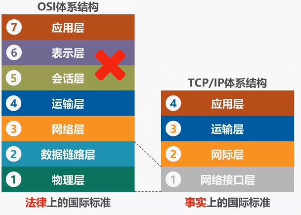

大多数用户每天都有接入因特网的需求，这就要求用户的主机必须使用 TCP/IP 协议。当然了，即使用户的网络不需要接入因特网，也可以使用 TCP/IP 协议，在用户主机的操作系统中，通常都带有符合 TCP/IP体系结构标准的 TCP/IP 协议族，而用于网络互联的路由器中，也带有符合 TCP 体系结构标准的 TCP 协议组，只不过路由器一般只包含网络接口层和网际层。

TCP/IP体系结构的网络接口层，并没有规定什么具体的内容，这样做的目的是可以互联全世界各种不同的网络接口，例如有线的以太网接口，无线局域网的 WiFi 接口，而不限定仅使用一种或几种网络接口。因此本质上 TCP/IP 体系结构只有上面的三层，IP 协议是 tcpip 体系结构网际层的核心协议，TCP 和 UDP 是 TCP 体系结构运输层的两个重要协议。

TCP/IP 体系结构的应用层包含了大量的应用层协议，例如 HTTP，SMTP，DNS，RTP等。即便大家是计算机网络的初学者，对 HTTP 这个缩写词也不会陌生，因为每当我们打开浏览器，在地址栏输入网址时，就会看到它。

IP 协议可以将不同的网络接口进行互联，并向其上的 TCP 协议和 UDP 协议提供网络互联服务。而 TCP 协议在享受 IP 协议提供的网络互联服务的基础上，可向应用层的相应协议提供可靠传输的服务。

UDP 协议在享受 IP 协议提供的网络互联服务的基础上，可向应用层的相应协议提供不可靠传输的服务。IP 协议作为 TCP/IP 体系结构中的核心协议，一方面负责互联不同的网络接口，也就是 IP over everything， 另一方面为各种网络应用提供服务，也就是 Everything over IP

在 TCP/IP 体系结构中包含有大量的协议，IP 协议和 TCP 协议是其中非常重要的两个协议，因此用 TCP 和 IP 这两个协议来表示整个协议大家族常称为 TCP/IP 协议族。顺便提一下，在嵌入式系统开发领域，TCP/IP 协议族常称为 TCP/IP 协议栈，这是因为 TCP/IP 协议体系的分层结构与数据结构中的站在图形画法上是类似的。

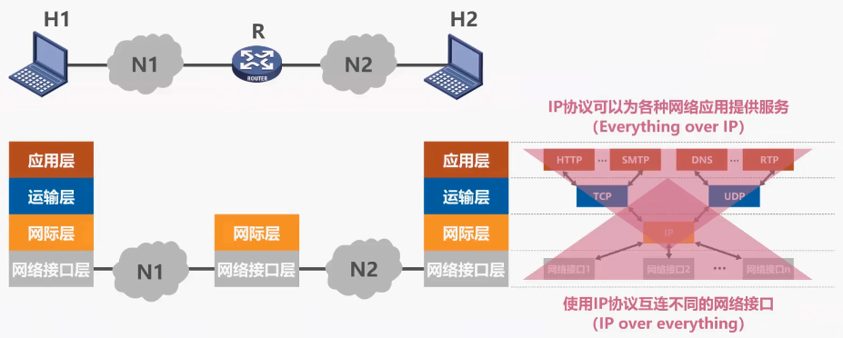

由于 TCP/IP 体系结构，为了将不同的网络接口进行互联，因此它的网络接口层并没有规定什么具体的内容。然而这对于我们学习计算机网络的完整体系而言，就会缺少一部分内容，因此在学习计算机网络原理时，往往采取折中的办法，也就是综合 OSI 和 TCP/IP 的优点，采用一种五层协议的原理体系结构。

五层协议的原理体系结构，从下到上依次为物理层、数据链路层、网络层、运输层、应用层。可以看出五层协议的原理体系结构，将 TCP/IP 体系结构的网络接口层又重新划分为了物理层和数据链路层，这样更有利于我们对计算机网络原理的学习。

&nbsp;

___

&nbsp;

**分层的必要性**

本节以 5 层协议的原理体系结构为例，介绍计算机网络体系结构分层的必要性。

- 计算机网络是个非常复杂的系统，早在最初的 ARPANET 设计时，就提出了分层的设计理念。
- 分层可将庞大而复杂的问题转化为若干较小的局部问题，而这些较小的局部问题就比较容易研究和处理。

下面我们按照由简单到复杂的顺序来看看实现计算机网络要面临哪些主要问题，以及如何将这些问题划分到相应的层次，层层处理。

物理层：例如两台计算机通过一条网线连接起来，需要考虑：

- 采用怎样的传输媒体（介质），例如网线、WIFI，严格来说这不是物理层的范围
- 用怎么样的物理接口
- 用怎么样的信号表示比特 0 和 1，例如使用方波信号，高电平表示 1，低电平表示 0（这里只是举例）

解决这些问题后，两台计算机就可以传输比特 0 和 1 了。这就是物理层要解决的问题。

首先来看最简单的情况，两台计算机通过一条网线连接起来，对于这种最简单的情况，我们需要考虑以下问题：

- 一个是采用怎样的传输媒体，比如这是我们常见的双绞线网线
- 另一个是在计算机上采用怎样的物理接口来连接传输媒体，例如这是 RJ45 以太网接口
- 还有一个需要考虑的问题是使用怎样的信号来表示比特 0 和 1？例如使用这样的方波信号，低电平表示 0，高电平表示 1

解决了这些问题，两台计算机就可以通过信号来传输比特 0 或 1。我们可以将这些问题划归到物理层。这里我们需要说明两点：

- 第一，严格来说，传输媒体并不属于物理层，它并不包含在体系结构之中
- 第二，计算机网络中传输的信号，并不是我们举例的方波信号，我们之所以举例成方波信号，是为了让初学者容易理解。在学习本身就不容易理解的，概念抽象的计算机网络体系结构时，不让其他技术细节再给大家造成学习障碍

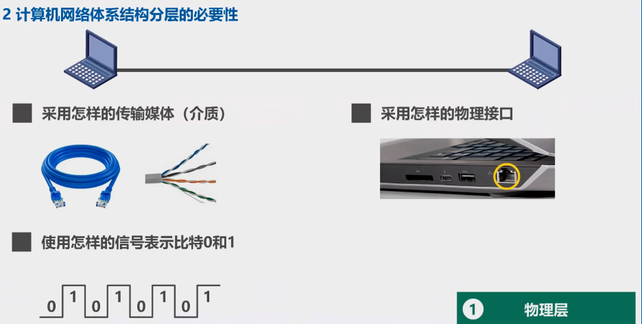

&nbsp;

- - -

链路层：实用的计算机网络一般都由多台主机构成，例如主机 ABCDE 通过总线互联构成了一个总线型网络，假设我们已经解决了物理层的问题，也就是说主机间可以发送信号来传输比特 0 或 1。我们来看看在这样一个总线型的网络上还面临什么需要解决的问题：

- 主机 A 要给主机 C 发送数据，但是表示数据的信号会通过总线传播到总线上的每一个主机。那么问题来了，主机 C 如何知道该数据是发给自己的，自己要接受，而主机 BDE 要如何知道该数据并不是发送给自己的，自己应该拒绝。这就很自然的引出了如何标识网络中各主机的问题，也就是主机编址问题。 
  大家可能听说过网卡上的 MAC 地址，其实它就是主机在网络中的地址，主机在发送数据时应该给数据附加上目的地址，当其他主机收到后，根据目的地址和自身地址来决定是否接受数据

- 这就又引出了一个问题，目的主机如何从信号所表示的一连串比特流中区分出地址和数据，也就是需要解决分组的封装格式问题。

- 另外对于总线型的网络，还会出现下面这种典型的问题，例如某个时刻总线是空闲的，也就是没有主机使用总线来发送数据，片刻之后，主机 B 和 D 同时向总线发送数据，这必然会造成信号碰撞。因此如何协调各主机征用总线也是必须要解决的问题。

- 需要说明的是这种总线型的网络早已淘汰，现在常用的是使用以太网交换机，将多台主机互联形成的交换式以太网。那么以太网交换机又是如何实现的？我们将这些问题全部划归到数据链路层。到这里大家可能会发现，只要解决了物理层和数据链路层各自所面临的问题，我们就可以实现分组在一个网络上传输了。

- - -

我们每天都会使用的因特网是由非常多的网络和路由器互联起来的，仅解决物理层和数据链路层的问题，还是不能正常工作。

我们来看这个例子，这是一个由 3 个路由器，4 个网络互联起来的小型互联网，我们可以把它看作是因特网中很小的一部分。在之前的例子中仅有一个网络，我们不需要对网络进行标识。而在本地中有多个网络，很显然我们面临着如何标识各网络以及各网络中各主机的问题。

换句话说，也就是网络和主机共同编址的问题。相信同学们一定听过 IP 地址，例如这是网络 N1 中各设备的 IP 地址，该类 IP 地址的前三个 10 进制数用来标识网络。第 4 个 10 进制数用来标识主机。在本例中网络 N1 的网络号为 192.168.1，该网络上的笔记本电脑服务器以及路由器接口的 IP 地址的前三个数应该都是 192.168.1，因为他们都在网络 N1 上，而第 4 个十进制数分别为 1，2，254 各不相同，用来标识他们自己。同理，这是网络 N2 上各设备的 IP 地址。

我们再来看另一个问题，源主机与目的主机之间的传输路径往往不止一条，分组从源主机到目的主机可走不同的路径，这样就引出了路由器如何转发分组的问题，以及如何进行路由选择的问题。我们将这些问题全部划归到网络层，至此我们解决了物理层、数据链路层以及网络层各自的问题，则可以实现分组在网络间传输的问题。

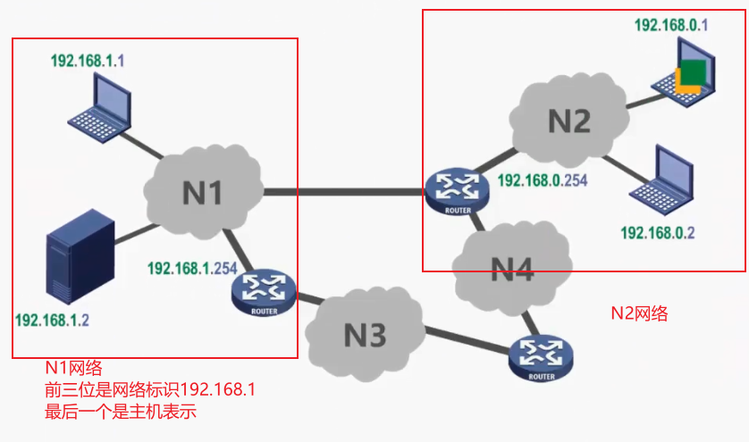

&nbsp;

- - -

例如假设这台主机装运行着两个与网络通信相关的应用进程，一个是浏览器进程，另一个是 QQ 进程。这台服务器中运行着与网络通信相关的服务器进程，某个时刻主机收到了来自服务器的分组，那么这些分组应该交给浏览器进程处理，还是应该交给 QQ 进程处理，这就引出了我们如何标识与网络通信相关的应用进程，进而解决进程之间基于网络通信的问题。

另外如果某个分组在传输过程中出现了误码，或者由于路由器繁忙，导致路由器丢弃分组，换句话说，若出现传输错误，应该如何处理？这也是需要解决的问题。我们将这些问题全部划归到运输层，至此我们解决了物理层、数据链路层、网络层以及运输层各自的问题，则可以实现进程之间基于网络的通信。

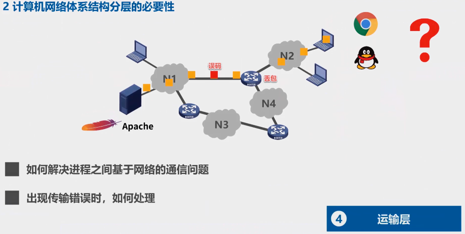

&nbsp;

- - -

在此基础上，只需制定各种应用层协议，并按协议标准编写相应的应用程序，通过应用进程间的交互来完成特定的网络应用。比如支持万维网应用的 HTTP 协议，支持电子邮件的 SMTP 协议，支持文件传送的 FTP 协议等，我们将这些问题全部划归到应用层：

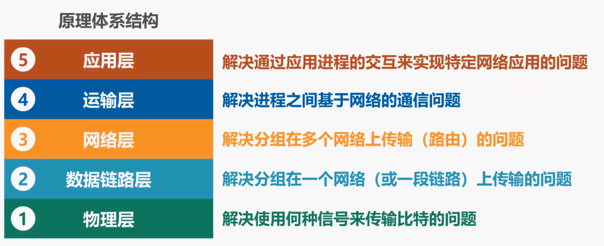

至此，我们将实现计算机网络所需要解决的各种主要问题，分别划归到了物理层、数据链路层、网络层、运输层和应用层，进而构成了 5 层协议体系的原理体系结构：

- 物理层解决使用何种信号来表示比特的问题
- 数据链路层解决分组在一个网络或一段链路上传输的问题
- 网络层解决分组在多个网络上传输和路由的问题
- 运输层解决进程之间基于网络的通信问题
- 应用层解决通过应用进程的交互来实现特定网络应用的问题

请大家思考一下这样一个问题。假设你是一名程序员，要编程解决实现计算机网络所面临的所有软件问题那么，你是愿意将这些问题全部放在一个模块中编程实现，还是愿意将他们划分到不同的模块中，逐模块编程实现，相信你一定会选择后者。

&nbsp;

___

**分层思想举例**

通过一个具体的网络通信实，来看看计算机网络体系结构分层处理方法。

假设网络拓扑如下，所示主机属于网络 N1，web 服务器属于网络 N2。 N1 和 N2，通过路由器互联。我们使用主机中的浏览，来访问 web 服务器，当输入网址后，主机会向外部服务器发送请求，WEB 服务器收到请求后，会发回相应的响应，主机的浏览器收到响应后，将其解析为具体的网页内容显示出来需要说明的是我们给出的只是一个简化的示意过程，这是因为本节课的重点是计算机网络体系结构分层处理方法，而不是浏览器和 web 服务器的实际交互过程。

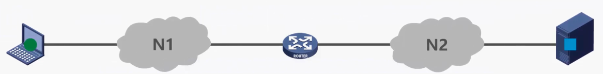

主机和 web 服务器之间基于网络的通信，** 实际上是主机中的浏览器应用进程与 web 服务器中的 web 服务器应用进程之间的基于网络的通信。**

那么体系结构的各层在整个过程中起到怎样的作用？

从主机端按体系结构自顶向下的顺序来看，应用层按 HTTP 协议的规定，构建一个 HTTP 请求报文，这是该报文的内容。

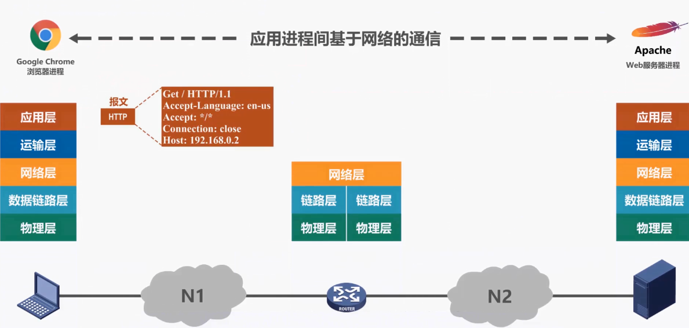

&nbsp;

应用层将 HTTP 报文交付给运输层处理，运输层给 HTTP 请求报文添加一个 TCP 首部，使之成为 TCP 报文段，这是 TCP 报文段的首部格式，该首部的作用主要是为了区分应用进程以及实现可靠传输。

运输层将 TCP 报文段交付给网络层处理,网络层给 TCP 报文段添加一个 IP 首使之质成为 IP 数据报，这是 IP 数据报的首部格式,该首部的作用主要是为了使 IP 数据报可以在互联网上传输，也就是被路由器转发。

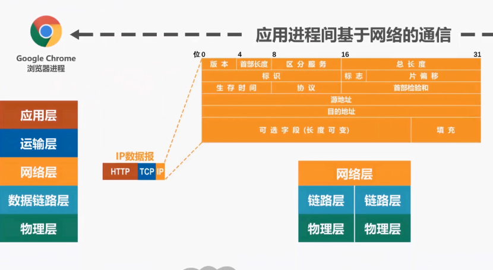

网络层将 IP 数据报交付给数据链路层处理，数据链路层给 IP 数据报添加一个首部和一个尾部,使之成为帧,假设网络 N1 是以太网，这是以太网帧首部的格式,该首部的作用主要是为了让帧能够在一段链路上或一个网络上传输，能够被相应的目的主机接收。

这是以太网帧尾部的格式，其作用是为了让目的主机检查所接收到的帧是否有误码.

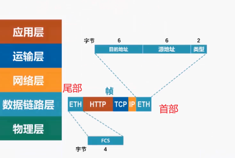

数据链路层将帧交付给物理层，物理层将帧看作是比特流，由于网络 N1 是以太网,因此物理层还会给该比特流前面添加前导码，这是前导码的内容,其作用是为了让目的主机做好接收帧的准备，物理层将添加有前导码的比特流,变换成相应的信号发送到传输媒体，信号通过传输媒体到达路由器.

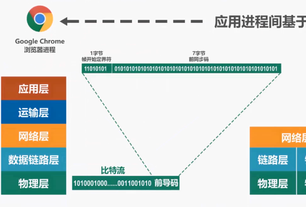

&nbsp;

我们来看 **路由器的处理过程：**

- 物理层将信号变换为比特流，然后去掉前导码后,将其交付给数据链路层，这实际上交付的是帧

- 数据链路层将帧的首部和尾部去掉后，将其交付给网络层，这实际上交付的是 IP 数据报

- 网络层解析 IP 数据报的首部，从中提取出目的网络地址，然后查找自身的路由表，确定转发端口，以便进行转发。

- 网络层将 IP 数据报交付给数据链路层

- 数据链路层给 IP 数据报添加一个首部和一个尾部，使之成为帧

- 数据链路层将针交付给物理层，物理层将帧看作是比特流。由于网络 N2 是以太网，因此物理层还会给该比特流前面添加前导码

- 物理层将添加有前导码的比特流，变换成相应的信号发送到传输媒体，信号通过传输媒体到达 Web 服务器。

&nbsp;

我们来看**Web 服务器的处理过程:**

- 物理层将信号变换为比特流，然后去掉前导码后，将其交付给数据链路层,这实际上交付的是帧

- 数据链路层将真的首部和尾部去掉后，将其交付给网络层,这实际上交付的是 IP 数据报

- 络层将 IP 数据报的首部去掉后，将其交付给运输层,这实际上交付的是 TCP 报文段

- 运输层将 TCP 报文段的首部去掉后，将其交付给应用层. 实际上交付的是 HTTP 请求报文

- 应用层对 HTTP 请求报文进行解析,然后给主机发回 HTTP 响应报文

与之前的过程类似，HTTP 响应报文需要在外部服务器层层封装，然后通过物理层变换成相应的信号，再通过传输媒体传输到路由器，路由器转发该响应报文给主机，主机通过物理层将收到的信号转换为比特流，之后通过逐层解封，最终取出 HTTP 响应报文。

&nbsp;

---

**专用术语**

需要说明的是这些专用术语来源于 OSI 的 7 层协议体系结构，但也适用于 TCP/IP 的 4 层体系结构和 5 层协议原理体系结构。我们将这些专用术语中最具代表性的三个作为分类名称，它们分别是：实体，协议，服务。

我们首先来看实体，** 实体是指任何可发送或接收信息的硬件或软件进程。**

例如这是通信双方的 5 层原理体系结构，我们在他们的各层中用标有字母的小方格来表示实体。

有了实体的概念，我们再来看对等实体，**它是指通信双方相同层次中的实体，例如图中实体 A 与实体 F 为对等实体，实体 B 与实体 G 为对等实体，以此类推。**

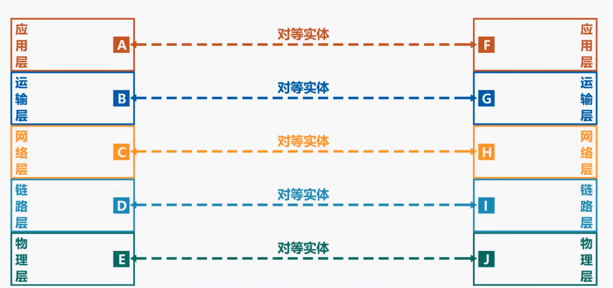

那么按照对等实体的定义，请同学们思考一下，通信双方的网卡是不是对等实体呢？通信双方中的正在进行通信的应用进程，是不是对等实体？回答是肯定的。

---

&nbsp;

有了对等实体的概念，我们再来介绍协议，协议是控制两个对等实体进行逻辑通信的规则的集合，例如应用层对等实体，在应用层协议的控制下进行逻辑通信，运输层对等实体在运输层协议的控制下进行逻辑通信，网络层对等实体在网络层协议的控制下进行逻辑通信，以此类推。

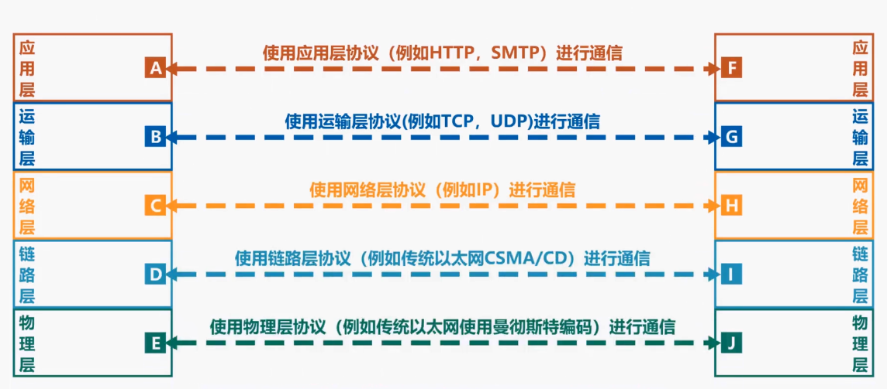

需要注意的是之所以称为逻辑通信，是因为这种通信其实并不存在，它只是我们假设出来的一种通信，目的在于方便我们单独研究体系结构某一层，而不用考虑其他层。

例如当我们研究运输层时，我们可以假设运输层的对等实体在进行逻辑通信，而不用顾及其他层。**计算机网络协议有三个要素，他们是语法、语义，同步。**

语法定义通信双方所交换信息的格式，例如这是 IP 数据报的格式：

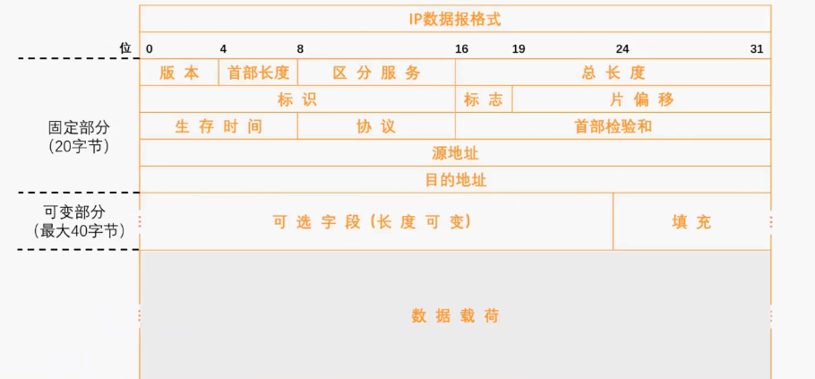

其中的小格子称为字段或域。数字表示字段的长度，单位是位，也就是比特.

语法就是定义了这些小格子的长度和先后顺序.换句话说，语法定义了所交换信息有哪些字段以及何种顺序构成，需要说明的是我们没有必要记住每种分组的格式，只要我们能看懂他们的格式说明就可以了。

当然了，如果同学们将来会从事计算机网络相关的开发教学研究等工作，像 IP 数据报，TCP 报文段，HTTP 报文等这些常见的分组格式，相信大家在学习和研究过程中自然而然的就会记住了。

语义定义通信双方所要完成的操作，这是我们上节课举过的应用实例。主机要访问远程 web 服务器，它会构建一个 HTTP 的 get 请求报文，然后将其发送给外部服务器，web 服务器收到该报文并进行解析，知道这是一个 HTTP 的 get 请求报文，于是就在自身内部查找所请求的内容，并将所找到的内容封装在一个 HTTP 响应报文装发回给主机，主机收到 HTTP 响应报文后，对其进行解析，取出所请求的内容，并由浏览器解析显示。这个例子就可以体现出通信双方收到分组后完成怎样的操作。这是 HTTP 协议的语义所规定的。

同步定义通信双方的时序关系。请注意并不是指时钟频率同步，例如这是 TCP 采用三报文握手建立连接的过程：

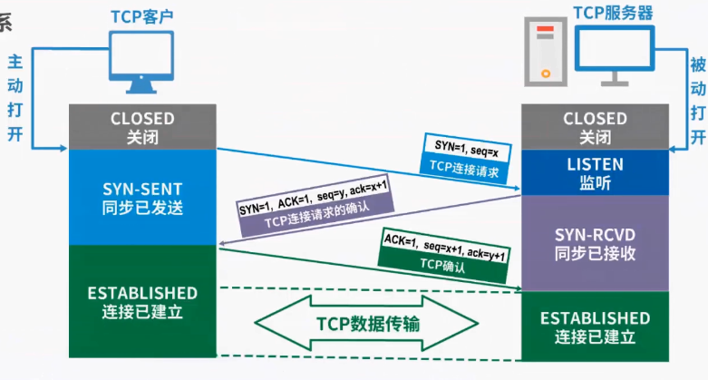

要想进行运输层 TCP 实体间的逻辑通信，首先必须建立连接,从连接建立的过程就可以看出 TCP 客户端和 TCP 服务器之间的时序关系以及各自的状态转换，只有双方建立连接后才能进行 TCP 数据传输。这个例子可以充分体现计算机网络协议三要素中的同步。

---

&nbsp;

有了协议的概念，我们再来介绍服务,在协议的控制下，两个对等实体间的逻辑通信，使得本层能够向上一层提供服务：

- 例如物理层对等实体，在物理层协议的控制下，向数据链路层提供服务
- 要实现本层协议，还需要使用下面一层所提供的服务，例如数据链路层对等实体享受物理层提供的服务，并在数据链路层协议的控制下进行逻辑通信，给网络层提供服务
- 网络层对等实体享受数据链路层提供的服务，并在网络层协议的控制下进行逻辑通信，给运输层提供服务
- 运输层对等实体享受网络层提供的服务，并在运输层协议的控制下进行逻辑通信，给应用层提供服务
- 应用层对等实体享受运输层提供的服务，并在应用层协议的控制下进行逻辑通信，给其上层也就是用户提供服务

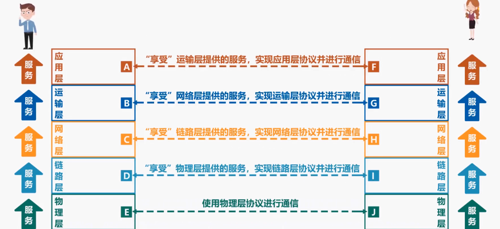

很明显协议是水平的，而服务是垂直的。请同学们需要特别注意的是实体看得见下层所提供的服务，但并不知道实现该服务的具体协议。换句话说，下层的协议对上层的实体是透明的。

这就好比，我们肯定看得见手机为我们提供的各种服务，但我们只是享受这些服务，而没有必要弄懂手机的工作原理。

再来看服务访问点的概念，它是指在同一系统中相邻两层的实体交换信息的逻辑接口，用于区分不同的服务类型。

例如数据链路层的服务访问点为帧的类型字段，网络层的服务访问点为 IP 数据报首部中的协议字段，运输层的服务访问点为端口号。

上层要使用下层所提供的服务，必须通过与下层交换一些命令，这些命令称为服务原语。

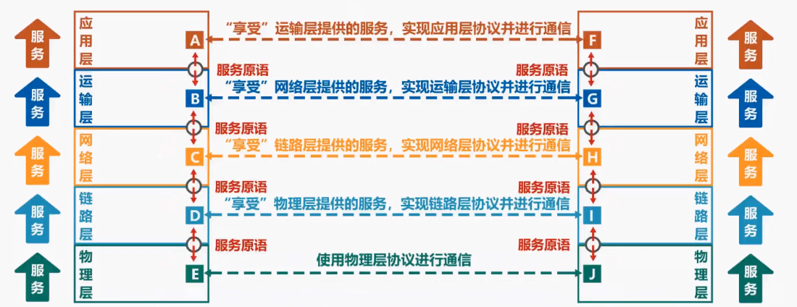

在计算机网络体系结构中，对通信双方所交互的数据包有专门的术语，我们把对等层次之间传送的数据包称为该层的协议数据单元，英文缩写词为 PDU。

例如物理层对等实体逻辑通信的数据包称为比特流，数据链路层对等实体逻辑通信的数据包称为真网络层对等实体逻辑通信的数据包称为分组。如果使用 IP 协议也称为 IP 数据报，运输层对等实体逻辑通信的数据包一般根据协议而定，例如使用 TCP 协议则称为 TCP 报文段，使用 UDP 协议则称为 UDP，用户数据报、应用层对等实体逻辑通信的数据包，一般称为应用报文。上述各层数据包可以统称为协议数据单元 PDU。

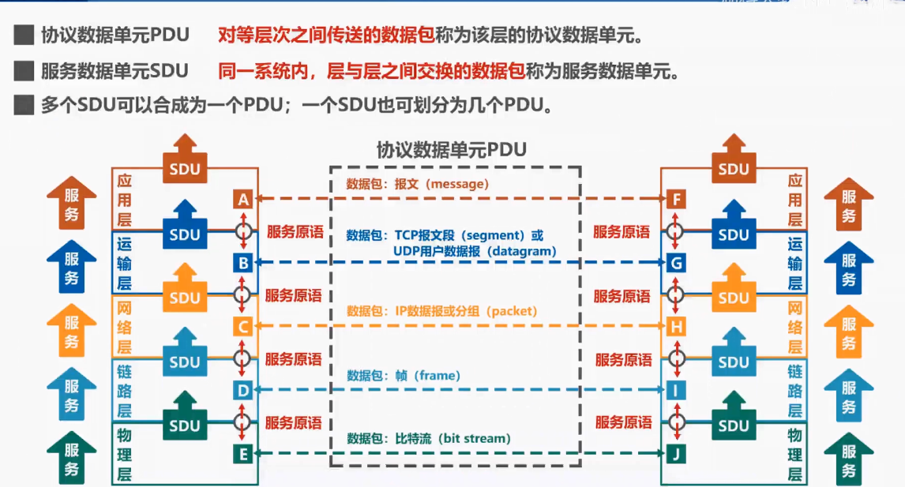

我们把同一系统内层与层之间交换的数据包成为服务数据单元，英文缩写词为 SDU。多个服务数据单元可以合成为一个协议数据单元，一个服务数据单元也可以划分为几个协议数据单元。

&nbsp;

- - -

**习题**

&nbsp;

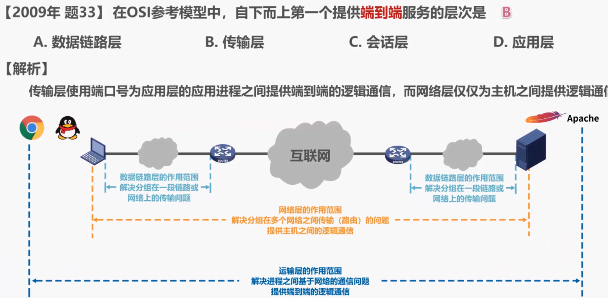
&nbsp;

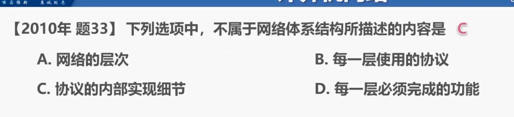
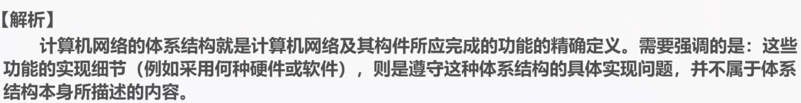
&nbsp;

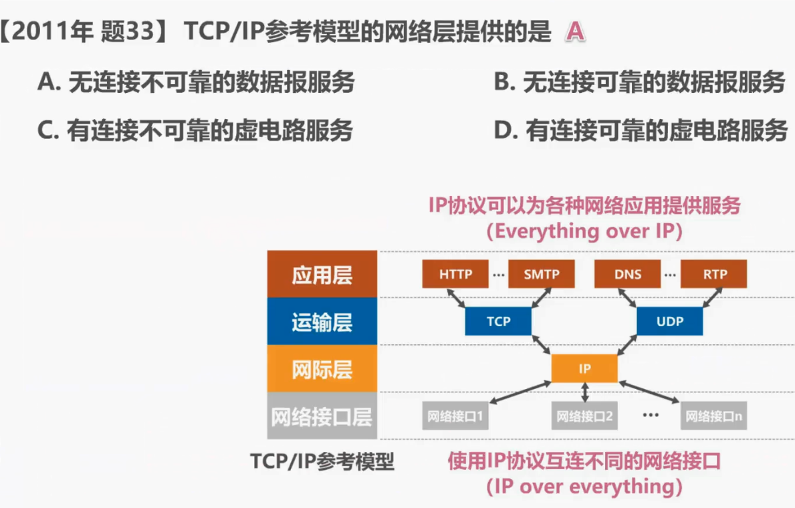
&nbsp;

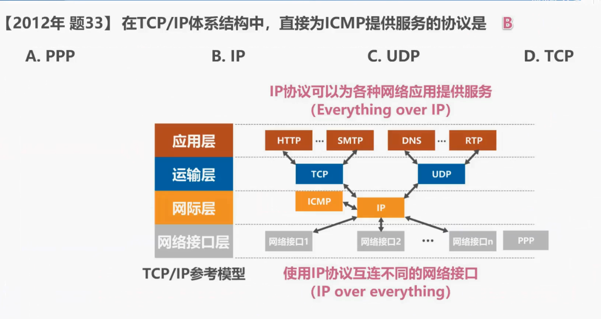
&nbsp;

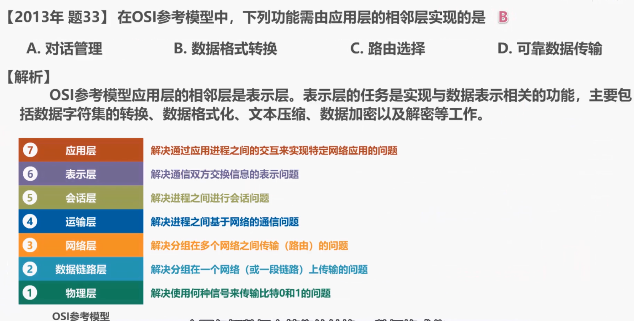
&nbsp;

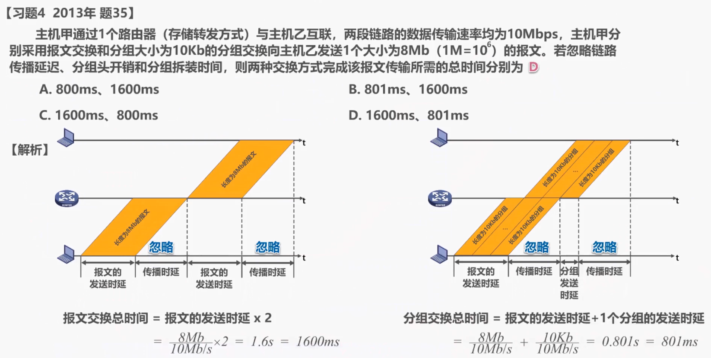
