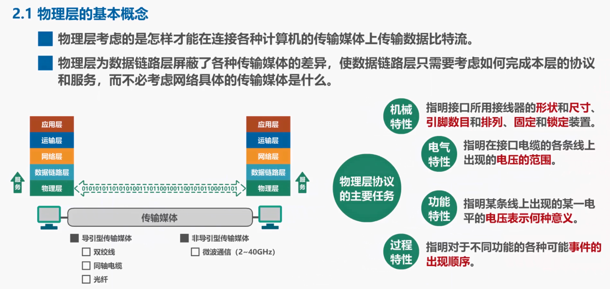

## 2.1 物理层的基本概念

在计算机网络中用来连接各种网络设备的传输媒体，种类众多，大致可以分为两类，一类是导引型传输媒体，另一类是非导引型传输媒体。

在导引型传输媒体中常见的有双绞线，同轴电缆，光纤。在非导引型传输媒体中常见的是微波通信，例如使用 2.4G 赫兹和 5.8G 赫兹频段的 WiFi。

**计算机网络体系结构中的物理层，就是要解决在各种传输媒体上传输比特 0 和 1 的问题，进而给数据链路层提供透明传输比特流的服务。所谓透明是指数据链路层看不见，也无需看见物理层究竟使用的是什么方法来传输比特 0 和 1 的，他只管享受物理层提供的比特流传输服务即可。**

物理层为了解决在各种传输媒体上传输比特 0 和 1 的问题，主要有以下 4 个任务，分别是机械特性、电气特性、功能特性以及过程特性：

- 机械特性指明接口所用接线器的形状和尺寸，引脚数目和排列顺序，固定和锁定装置
- 电气特性指明在接口电缆的各条线上，出现的电压的范围
- 功能特性指明某条线上出现的某一电瓶的电压表示何种意义
- 过程特性指明对于不同功能的各种可能事件的出现顺序

由于传输媒体的种类众多，例如双脚线，光纤等，物理连接方式也很多，例如点对点连接，广播连接等。因此物理层协议种类就比较多，每种物理层协议都包含了上述 4 个任务的具体内容。

因此在学习物理层时，我们应该将重点放在掌握基本概念上，而不是某个具体的物理层协议。

通过本节课的学习，同学们应该理解并记住，物理层考虑的是怎样才能在连接各种计算机的传输媒体上传输数据比特流，它为数据链路层屏蔽了各种传输媒体的差异，使数据链路层只需要考虑如何完成本层的协议和服务，而不必考虑网络具体使用的传输媒体是什么。

