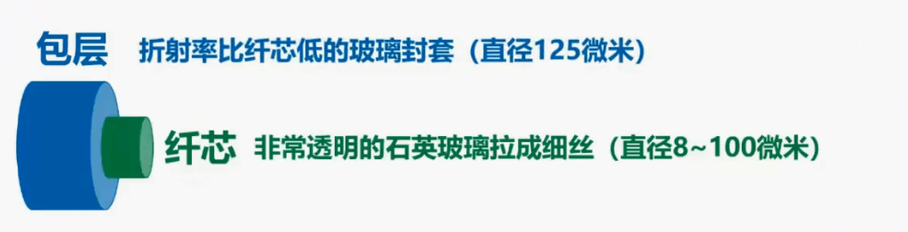
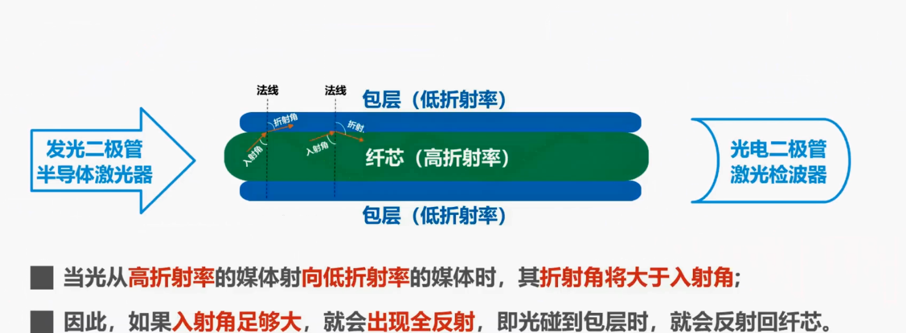
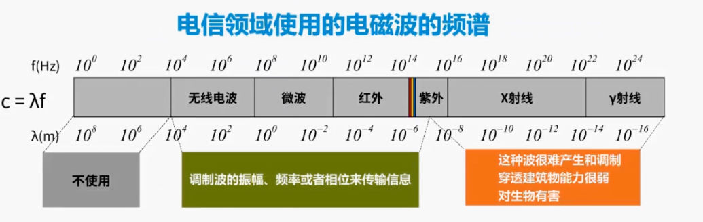

## 2.2 物理层下面的传输媒体

传输媒体不属于计算机网络体系结构的任何一层，如果非要将它添加到体系结构中，那只能将其放在物理层之下。

传输媒体可分为两类：一类是导引型传输媒体，另一类是非导引型传输媒体。

在导引型传输媒体中，电磁波被导引沿着固体媒体传播，常见的导引型传输媒体有同轴电缆，双脚线，光纤电力线；

而非导引型传输媒体，是指自由空间可使用的电磁波，有无线电波，微波、红外线、可见光。

&nbsp;

**同轴电缆**

我们首先来看导引型传输媒体，同轴电缆，这是一根同轴电缆的示意图，这是内导体铜制芯线，可以是单股实心线或者是多股绞和线，这是绝缘层，这是网状编织的外导体屏蔽层，这是绝缘保护套层，这是同轴电缆的横切面，可以看出各层都是共圆心的，也就是同轴心的，这就是同轴电缆名称的由来。

同轴电缆有两类，一类是 50 欧阻抗的基带同轴电缆，用于数字传输，在早期局域网中广泛使用。

另一类是 75 欧阻抗的宽带同轴电缆，用于模拟传输，目前主要用于有线电视的入户线。

铜轴电缆价格较贵，且布线不够灵活和方便。随着集线器的出现，在局域网领域双绞线取代了同轴电缆。

&nbsp;

## 双绞线

我们来看双绞线，这是无屏蔽双脚线电缆的示意图，这是屏蔽双脚线电缆的示意图。

双绞线是最古老也是最常用的传输媒体，把两根互相绝缘的铜导线并排放在一起，然后按照一定规则绞合起来，就构成了双绞线。例如图中所示的这根无屏蔽双绞线电缆，包含 8 根通道线，每两根搅合成一条双脚线，蓝色线和蓝白双色线进行搅和，橙色线和橙白双色线进行绞合，绿色线和绿白双色线进行绞合，棕色线和棕白双色线进行搅和。绞合有两个作用，一个是抵御部分来自外界的电磁干扰，另一个是减少相邻导线的电磁干扰。

屏蔽双绞线电缆比无屏蔽双绞线电缆，增加了金属丝编织的屏蔽层，提高了抗电磁干扰的能力。当然了价格也要更贵一些。

这是常用的绞和线的类别，带宽和典型应用。目前家庭局域网主流带宽为 1G 比特每秒，选用大品牌质量好的超 5 类双绞线电缆可以满足。考虑到未来发展，在经济条件允许的情况下，建议选用 6A 类双脚线电缆，以满足万兆局网的需求。

&nbsp;

## 光纤

再来看光纤，这是一根室外四芯光缆的示意图，这是它的内部结构图。由于光纤非常细，因此必须将它做成很结实的光缆，一根光缆少则只有一根光纤，多则可包括数十甚至是数百根光纤，再加上加强圈和填充物，就可以大大提高机械强度，必要时还可放入远供电源线，最后加上包带层和外护套，就可以使抗压强度达到几千克，完全可以满足工程施工的强度要求。

光纤的纤芯非常细，多模光纤的纤芯直径有 50 微米和 62.5 微米，单模光纤的纤芯直径为 9 微米，而纤芯外面的包层也非常细，直径不超过 125 微米，在光纤通信中常用三个波段的中心，分别位于 0.85 微米、1.3 微米和 1.55 微米。

光纤有很多优点，例如：

- 通信容量非常大，传输损耗小，在远距离传输时更加经济
- 抗雷电和电磁干扰性能好，这在有大电流脉冲干扰的环境下尤为重要
- 无串音干扰，保密信号不易被窃听
- 体积小，重量轻，例如一公里长的 1000 段双脚线电缆，约重 8000 公斤，而同样长度但容量大得多的一段两星光缆仅撞 100 公斤

当然了光纤也有自身的缺点，例如割接光纤需要专用设备，目前光电接口的价格还比较贵。

接下来我们来看看光在光纤中传输的基本原理，这是纤芯，它是由非常透明的石英玻璃拉成的细丝，这是包裹在纤芯外层的包层，它是折射率比光纤低的玻璃封套：

在发送端可以采用发光二极管或半导体激光器作为光源，在接收端可以采用光电二极管或激光检波器检测光脉冲。当光从高折射率的媒体射向低折射率的媒体时，其折射角将大于入射角，如图所示，因此如果入射角足够大，就会出现全反射，也就是光碰到包层时就会反射回纤芯。该过程反复进行，光也就沿着光纤传输下去。

实际上只要从纤芯中射到纤芯表面的光线的入射角，大于某一个临界角度,就可产生全反射，因此可以存在许多条不同角度入射的光线，在一条光纤中进行传输.这种光纤称为多模光纤。由于光的色散问题，光在多模光纤中传输一定距离后.必然产生信号失真，也就是脉冲展宽,如图所示，因此多模光纤只适合近距离传输，例如在建筑物内。

多模光纤对光源的要求不高，可以使用比较便宜的发光二极管，相应的可采用光电二极管检测光脉冲：

若光纤的直径减小到只有一个光的波长，则光纤就像一根波导那样，它可使光线一直向前传播，而不会产生多次反射。这样的光纤称为单模光纤，单模光纤没有模式色散，在 1.3 微米波长附近，材料色散和波导色散大小相等，符号相反，两者正好抵消，没有脉冲展宽问题，如图所示。

单模光纤适合长距离传输，且衰减小，但它的制造成本高，对光源要求也高，需要使用昂贵的半导体激光器作为光源，相应的需要采用激光剪播器检测光脉冲。

&nbsp;

## 电力线

我们再来看看采用电力线作为传输媒体的情况，这并不是什么新技术，早在 20 世纪 20 年代初期就出现了。应用电力线传输信号的实例最早是电力线电话。

目前如果要构建家庭高性能局域网，采用电力线作为传输媒体，是不能满足要求的。

对于装修时没有进行网络布线的家庭，可以采用这种方式。

对于一些采用独立房间进行办公的企业来说，每间办公室的电脑数量不多，而又不希望跨办公室进行布线，也可以采取这种方式。

每个办公室只需根据需求，在电源插座上插入一个或多个电力猫即可。

&nbsp;

## 电磁波

下面我们来看非导引型传输媒体，也就是自由空间，我们可以利用电磁波在自由空间的传播来传送数据信息，这是电磁波的频谱

这段频率范围不用于电信领域，而这一段频率范围的电磁波很难产生和调制，由于频率非常高，波长就非常短，因此穿透障碍物的能力就非常弱，更为严重的是该频段的电磁波对生物是有害的，因此人们很难利用该频率范围的电磁波进行数据传输，这段频率范围的电磁波可以通过调制波的振幅、频率或相位来传输信息：

这是国际电信联盟 ITU 对电磁波频段的划分：

从极低频到甚低频，也就是从极长波到甚长波，这些频段并不用于电信领域。

从低频到甚高频，也就是从长波到米波，这些频段的电磁波又称为无线电波，用于国际广播，海事和航空通讯，电台广播、电视广播等：

从特高频到极高频，也就是从分米波到毫米波，这些频段的电磁波又称为微波，用于无线电话，无线网络，雷达，人造卫星接收，射电天文、人体扫描等。

无线电波中的低频和中频频段，主要利用地面波进行传输，而高频和甚高频频段主要是靠电离层的反射：

微波通信在数据通信中占有重要地位，频率范围为 300 兆赫兹到 300g 赫兹，也就是波长一米到一毫米，但主要使用 2~40 级赫兹的频率范围。微波在空间直线传播，由于微波会穿透电离层而进入宇宙空间，因此它不能经过电离层的反射传播到地面上很远的地方。传统的微波通信主要有两种方式，一种是地面微波接力通信，另一种是卫星通信。

由于微波在空间是直线传播的，而地球表面是个曲面，因此其传播距离受到限制，一般只有 50 公里左右，但若采用 100 米高的天线塔，则传播距离可增大到 100 公里。为实现远距离通信，必须在一条微波通信信道的两个终端之间建立若干个中继站，中继站把前一站送来的信号经过放大后，再发送到下一站，故称为接力。

常用的卫星通信方法是在地球站之间，利用位于约 36,000 公里高空的人造同步地球卫星，作为中继器的一种微波接力通信。其最大特点是通信距离远，相应的传播时延也比较大，一般在 250~300 毫秒之间。除同步卫星外，低轨道卫星通信系统已开始在空间部署，并构成了空间高速链路。

&nbsp;

## 红外线

利用红外线来传输数据，相信大家并不陌生，很多家用电器，例如电视空调等都配套有红外遥控器，以前的笔记本电脑基本都带有红外接口，可以进行红外通信。

红外通信属于点对点无线传输，中间不能有障碍物，传输距离短，传输速率也很低。现在笔记本电脑已经取消了红外接口，但很多智能手机还带有红外接口，以方便用户对电视空调等家用电器进行红外遥控。

&nbsp;

在本节课中，我们介绍了物理层下面的传输媒体，这部分内容不是重点和难点，只要求同学们了解即可。
