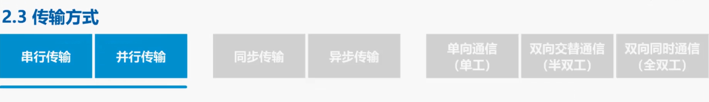

## 2.3 传输方式

本节课我们介绍几种传输方式：

- 串行传输和并行传输
- 同步传输和异步传输
- 单工，半双工以及全双工通信

&nbsp;

**串行**

我们首先来看串行传输和并行传输，串行传输是指数据是一个比特依次发送的，因此在发送端和接收端之间只需要一条数据传输线路即可。

并行传输是指一次发送 n 个比特，而不是一个比特，为此在发送端和接收端之间需要有 n 条传输线路。

并行传输的优点是速度为串行传输的 n 倍，但也存在一个严重的缺点，即成本高。

请同学们思考一下，在计算机网络中，数据在传输线路上的传输采用的是串行传输还是并行传输？答案是串行传输。

计算机内部的数据传输常采用并行传输方式，例如 CPU 与内存之间通过总线进行数据传输，常见的数据总线宽度有 8 位，16 位、32 位和 64 位。

&nbsp;

**同步传输与异步传输**

再来看同步传输和异步传输，采用同步传输方式，数据块以稳定的比特流的形式传输，字节之间没有间隔，接收端在每个比特信号的中间时刻进行检测，以判别接收到的是比特 0 还是比特 1。由于不同设备的时钟频率存在一定差异，不可能做到完全相同，在传输大量数据的过程中，所产生的判别时刻的累积误差，会导致接收端对比特信号的判别错位。

因此需要采取方法是收发双方的时装保持同步，实现收发双方时钟同步的方法主要有两种：

- 一种是外同步，也就是在收发双方之间添加一条单独的时钟信号线，发送端在发送数据信号的同时，另外发送一路时钟同步信号，接收端按照时钟同步信号的节奏来接收数据
- 另一种是内同步，也就是发送端将时钟同步信号编码到发送数据中一起传输。例如传统以太网所采用的就是曼彻斯特编码，这部分内容我们将在下节课详细讨论
- 采用异步传输方式时，以字节为独立的传输单位，字节之间的时间间隔不是固定的，接收端仅在每个字节的起始处对字节内的比特实现同步。** 为此通常要在每个字节前后分别加上起始位和结束位，这里异步是指字节之间异步，也就是字节之间的时间间隔不固定， 但字节中的每个比特仍然要同步，也就是个比特的持续时间是相同的。**

&nbsp;

**单工，半双工以及全双工通信**

再来看单工，半双工和全双工通信：

- 单工通信又称为单向通信，通信双方只有一个数据传输方向，比如无线电广播采用的就是这种通信方式
- 半双工又称为双向交替通信，通信双方可以相互传输数据，但不能同时进行。例如对讲机采用的就是这种通信方式
- 全双工通信又称为双向同时通信，双方可以同时发送和接收信息，例如电话采用的就是这种通信方式
- 单向通信只需要一条信道，而双向交替通信或双向同时通信则都需要两条信道，每个方向各一。

本节的内容比较容易理解，重点是弄清楚同步传输中的同步，异步传输中的异步，它们各自的含义是什么。