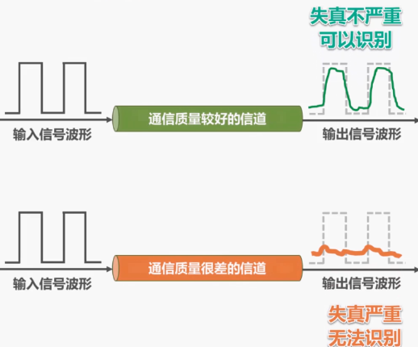
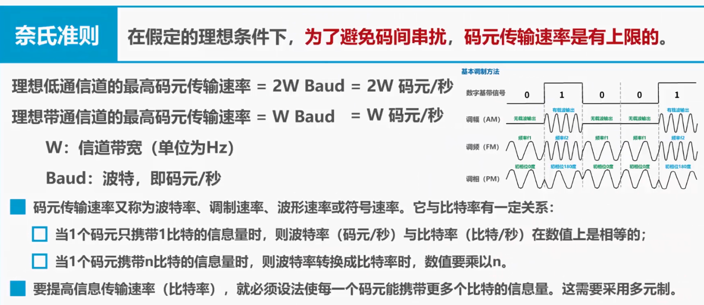
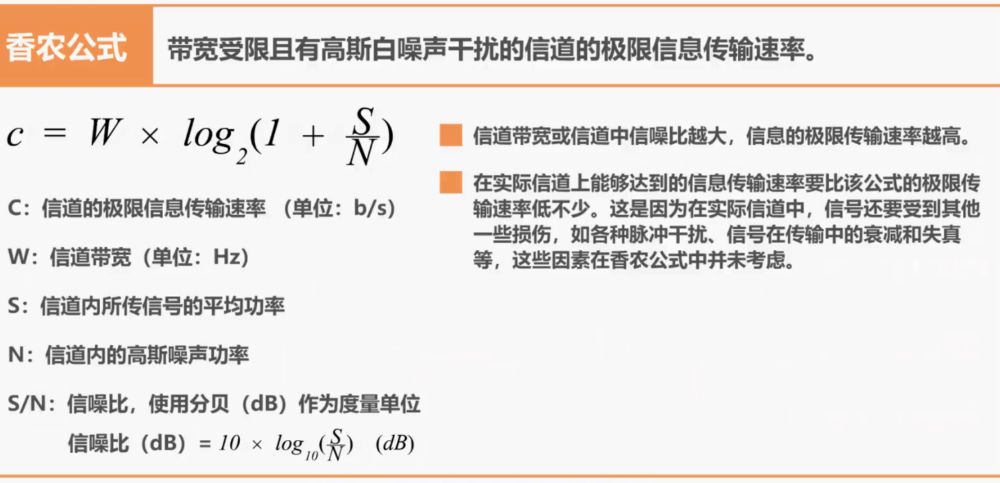
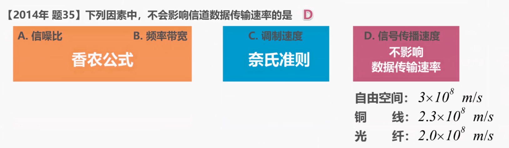
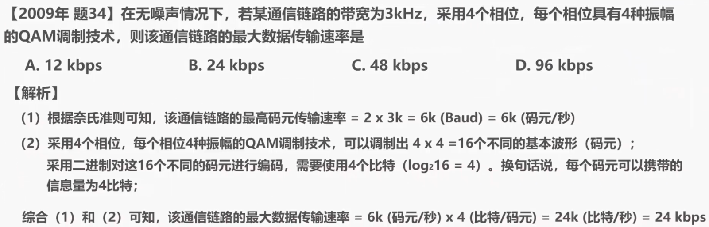
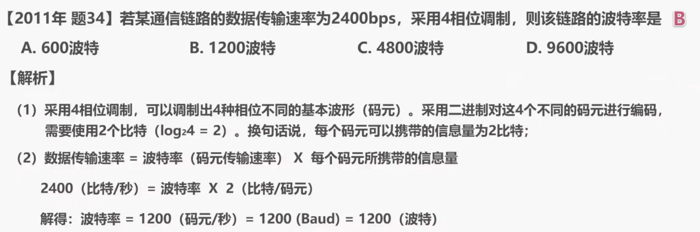
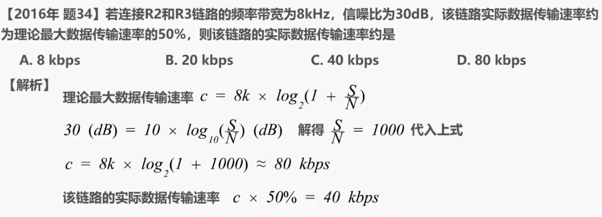
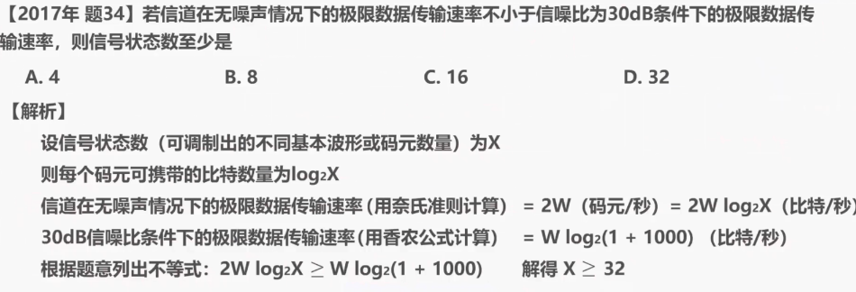

## 2.5 信道的极限容量

本节课我们介绍信道极限容量的有关问题。

我们都知道信号在传输过程中会受到各种因素的影响，如图所示，这是一个数字信号，当它通过实际的信道后，波形会产生失真，当失真不严重时，在输出端还可根据以失真的波形还原出发送的码元，但当失真严重时，在输出端就很难判断这个信号在什么时候是 1 和在什么时候是 0。

信号波形失去了码元之间的清晰界限，这种现象叫做码间串扰。

产生失真的原因主要有码元传输速率、信号传输距离，噪声干扰，传输媒体质量等。

&nbsp;

**奈氏准测**

早在 1924 年，奈奎斯特就推导出了著名的奈氏准则，他给出了在假定的理想条件下，为了避免码间串扰，码元传输速率的上限。

理想低通信道的最高码元传输率等于 2W 波特，理想带通信道的最高，码元传输速率等于 W 波特，这里的 W 是信道带宽，单位为赫兹，单词 Baud 的意思是波特，也就是码元每秒，因此上述公式可进一步写为 2w 码元/秒 和 w 码元/秒：

码元传输速率又称为波特率，调制速率，波形速率或符号速率，它与比特率有一定的关系。

当一个码元只携带一比特的信息量时，波特率，也就是单位为码元每秒与比特率也就是单位为比特每秒，在数值上是相等的。

当一个码元携带 n 比特的信息量时，则波特率转换成比特率时，数值要乘以 n。

要提高信息的传输速率，就必须设法使每一个码元能够携带更多个比特的信息量，‍‍这需要采用多元制。‍‍

还记得我们上节课中介绍的调幅、调频以及调向这三种基本调制方法吗？‍‍它们属于二元调制，只能产生两种不同的码元，也就是两种不同的基本波形。‍‍因此‍‍每个码元只能携带一比特的信息量。

而混合调制属于多元调制。例如‍‍ QAM16 可以调制出 16 种不同的码元，因此每个码元可以携带 4 比特的信息量。

‍

需要说明的是‍‍实际的信道所能传输的最高码元速率要明显低于奈式准则给出的上限值，‍‍这是因为奈式准则是在假定的理想条件下推导出来的，他不考虑其他因素，例如传输距离、‍‍噪声干扰，传输媒体质量等。

仅从公式来看，只要采用更好的调制方法，‍‍让码元可以携带更多的比特，岂不是可以无限制的提高信息的传输速率吗？答案是否定的，‍‍信道的极限信息传输速率还要受限于实际的信号，在信道中传输时的信噪比，‍‍因为信道中的噪声也会影响接收端对码元的识别，并且噪声功率相对信号功率越大，‍‍影响就越大。

&nbsp;

**香农公式**

1948 年香农用信息论的理论推导出了带宽受限，‍‍且有高斯白噪声干扰的信道的极限信息传输速率，具体公式如下所示。其中‍‍ c 是信道的极限信息传输速率，单位是比特每秒，w 是信道带宽，单位为赫兹，‍‍s 是信道内所传送信号的平均功率，n 是信道内的高斯噪声功率，s 比 n 是信噪比‍‍使用分贝作为度量单位如下所示。‍‍

从香农公式可以看出，信道带宽或信道中信噪比越大，信息的极限传输速率就越大。

需要说明的是在实际信道上能够达到的信息传输速率，要比该公式的极限传输速率低不少，‍‍这是因为在实际信道中信号还要受到其他一些损伤，例如各种脉冲干扰，‍‍信号在传输中的衰减和失真等，这些因素在香农公式中并未考虑。‍‍

综合来看奈式准则和香农公式。在信道带宽一定的情况下，要想提高信息的传输速率，‍‍就必须采用多元制，‍‍并努力提高信道中的信噪比。

自从香农公式发表以后，各种新的信号处理和调制方法‍‍就要不断出现，其目的都是为了尽可能的接近香农公式所给出的传输速率极限。‍‍

&nbsp;

**习题**

接下来‍‍我们来做几个与这两个公式有关的练习题。

这是计算机专业考研全国统考计算机网络部分‍‍2014 年的题 35，答案是 D。

从香农公式可知，信噪比和频率带宽都会影响信道数据传输速率。‍‍从奈式准则可知，‍‍调制速度也就是码元传输速度和码元所携带的比特数量，都会影响信道数据传输速率，‍‍而信号的传播速度不影响数据传输速率。‍‍我们在之前的课程中‍‍曾建议同学们记住电磁波在不同传输媒体的传播速率，不知大家是否还记得。‍‍

来看 2009 年的题 34，在无噪声的情况下，若某通信链路带宽为 3000 赫兹，‍‍采用 4 个相位，每个相位具有 4 种振幅的 QAM 调制技术，‍‍则该通信链路的最大数据全速率是多少？我们一起来做这道题：

一，根据奈式准则可知，‍‍该通信链路的最高码元传送率 = 2×3k = 6k 波特，也就是 6k 码元每秒。‍‍

二，采用 4 个相位，每个相位 4 种振幅的 qam 调制技术，可以调制出 16 个不同的基本模型，‍‍也就是 16 个不同的码元，采用二进制对这 16 个不同的码源进行编码，‍‍需要使用 4 个比特。‍‍换句话说，每个码元可以携带的信息量为 4 比特。

综合 1 和 2 可知，‍‍该通信链路的最大数据传送率等于 6k 码元每秒 ×4 比特每码元‍‍ = 等于 24k 比特每秒，也就是 24kbps

因此本题的正确答案是选项 B。实际上对于这种类型的题目，不管题目给出的调制技术多么牛，或者对于我们而言多么陌生，‍‍这都不会影响我们解题。‍‍我们只需关心这种调制技术，可以调制出多少个不同的基本波形即可。

&nbsp;

来看 2011 年的题目 34，‍‍答案是选项 B，我们来看解题过程：

一，采用四相位调制，可以调制出 4 种相位不同的基本波型，‍‍采用二进制对这 4 种不同的波形进行编码，需要使用两个比特。换句话说，‍‍每个码元可以携带的信息量为两个比特。‍‍

二，数据传送速率等于波特率，也就是码元传输速率 乘以‍‍ 每个码元所携带的信息量。带入本题的相关数值，也就是 2400 比特每秒，等于波特率‍‍乘以 2 比特美码元，解得波特率等于 1200 马元每秒，也就是 1200 波特。‍‍

再来看 2016 年的题 34，若连接 R2 和 R3 链路的频率带宽为 8000 赫兹，‍‍性噪比为 30 分贝，该链路实际数据传输速率约为理论最大数据传输速率的 50%，‍‍则该链路的实际数据传输速率约是多少？

根据香农公式可知，‍‍本题中的理论最大数据传送率为 8000 赫兹，乘以 log 以 2 为底，1+ 信噪比的对数，‍‍信噪比采用分贝表示，题目所给信噪比为 30 分贝，可计算出信噪比为 1000，代入上式，‍‍可计算出结果约等于 80kbps。根据提议，‍‍该链路的实际数据传输率是理论值的 50%，计算结果为 40kbps‍‍，因此选项 C 正确。‍‍

再来看 2017 年的题 35，答案是选项 D。

设信号状态数，‍‍也就是可调制出的不同基本波形或码元数量为 x，则每个码元可携带的比特数量为‍‍ log 以 2 为底 x 的对数。‍‍信道在无噪声情况下的极限数据传输速率，用奈式准则来计算，‍‍等于 2w 码元每秒，等于 2w log 以 2 为底 x 的对数比特每秒。‍‍信道在无噪声情况下的极限数据传输速率，用香农公式来计算，等于‍‍ w 乘以 log 以 2 为底，1+1000 的对数，单位为比特每秒，其中的 1000‍‍是 30 分贝信噪比换算出来的比值，根据题意列出不等式，解得‍‍ x 大于等于 32。

​在本节课中，我们介绍了与信道极限容量相关的两个公式，一个是奈式准则，‍‍另一个是香农公式。他们为提高信息传输速率提供了理论依据，希望同学们能够掌握‍‍并利用这两个公式进行一些简单的相关计算。

&nbsp;

**物理层习题**

