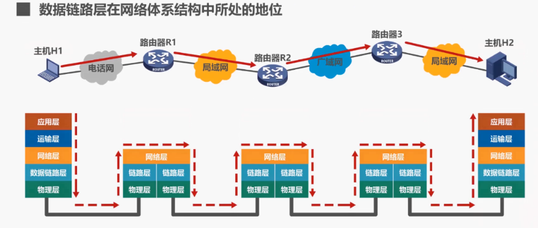
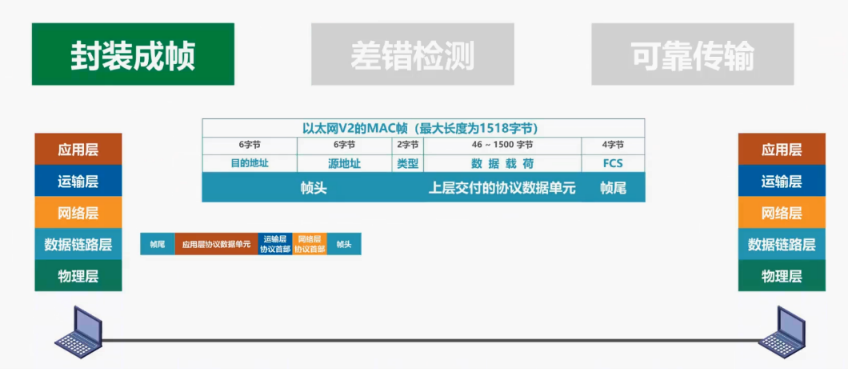
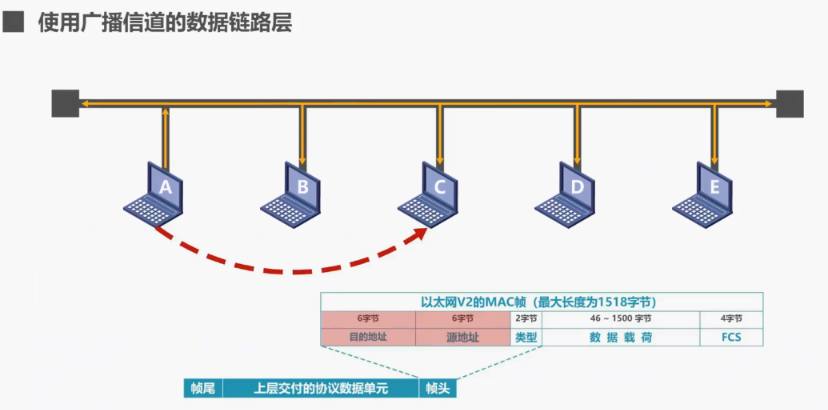
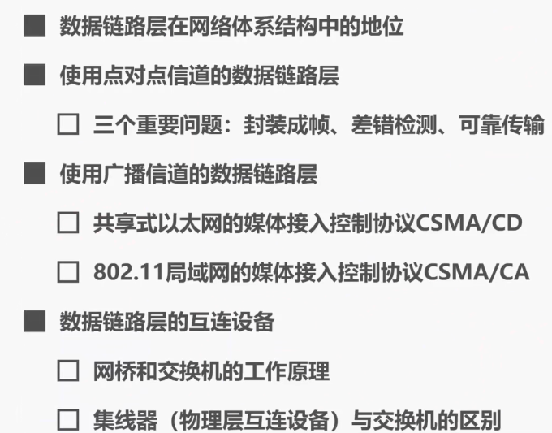

##3.1 数据链路层概述

本节课我们对数据链路层进行概述，我们首先来看看数据链路层在网络体系结构中的地位。

如图所示主机 H1 给主机 H2 发送数据，中间要经过三个路由器和电话网、局域网以及广域网等多种网络。

从五层协议原理体系结构的角度来看，主机应具有体系结构中的各个层次，而路由器只需具有体系结构中的下面三层，各设备通过物理层下面的传输媒体进行互联，当主机 H1 向 H2 发送数据时，数据的流动如图所示：

- 主机 H1 将在发送的数据逐层封装后，通过物理层将构成数据包的个比特转换为电信号，发送到传输媒体，数据包进入路由器后，由下往上逐层解封到网络层。
- 路由器根据数据包的目的网络地址和自身转发表，确定数据包的转发端口，然后从网络层向下逐层封装数据包，并通过物理层将数据包发送到传输媒体。
- 数据包最终到达主机 H2 时，还要由下往上逐层解封，最终解封出主机 H1 所发送的数据。

上述过程我们在第一章的计算机网络体系结构，分层思想举例那节课中就介绍过了，然而当我们专门研究数据链路层的问题时，在大多数情况下，我们可以只关心数据链路层，而不考虑网络体系结构的其他各层。

换句话说，我们可以想象数据包只在数据链路层，从左向右沿水平方向传送。从数据链路层来看，主机 H1 到 H2 的通信，可以看成是在 4 段不同的链路上的通信组成的。

所谓链路，就是从一个节点到相邻节点的一段物理线路，中间没有任何其他的交换节点。要在链路上传输数据，仅有链路还不够，还需要一些通信协议来控制这些数据的传输。若把实现这些协议的硬件和软件加到电路上，就构成了数据链路。

在数据链路层上传输的数据包又称为帧，也就是说数据链路层以帧为单位传输和处理数据。

&nbsp;

接下来我们介绍数据链路层的三个重要问题，他们是**封装成帧，差错检测，可靠传输.**
首先来看**封装成帧** **。如图所示，两台主机通过一段链路互联，两台主机都会对所发送或接收的数据包进行 5 个层次的封装或解封：

- 发送方将待发送的数据通过应用层封装成为应用层协议数据单元，然后交付给运输层
- 运输层为其添加运输层协议首部，使之成为运输层协议数据单元，然后交付给网络层
- 网络层为其添加网络层协议首部，使之成为网络层协议数据单元，然后交付给数据链路层
- 数据链路层给网络层协议数据单元，添加一个数据链路层协议首部简称为帧头，还要给其添加一个帧尾
- 我们将数据链路层给网络层交付的协议数据单元，添加帧头和帧尾的操作成为封装成帧。添加帧头和帧尾的目的都是为了在链路上以帧为单元来传送数据，也就是为了实现数据链路层本身的功能
- 例如，这是以太网版本 2 的 MAC 帧格式，这三个字段是帧头，该字段是帧尾，而这个字段是上层交付的协议数据单元

&nbsp;

- - -

再来看**差错检测**，发送方将封装好的帧通过物理层发送到传输媒体，帧在传输过程中遭遇干扰后可能会出现误码，也就是比特 0 可能变成了比特 1，反之亦然。

那么大家通过动画演示，可以很容易看出正在传输过程中出现了误码，但是接收方主机如何判断真在传输过程中是否出现了误码，这可以通过检测码来发现。

发送方在发送帧之前，基于待发送的数据和检错算法，计算出检错码，并将其封装在帧尾。例如以太网版本 2 的 MAC 帧的帧尾，就是 4 字节的帧检验序列 FCS 字段。要写入该字段的内容，也就是我们所说的检错码：

接收方主机收到帧后，通过检错码和检错算法，就可以判断出真在传输过程中是否出现了误码。

&nbsp;

- - -

再来看**可靠传输**，接收方主机收到有误码的帧后，是不会接受该帧的，将其丢弃。如果数据链路层向其上层提供的是不可靠服务，那么丢弃就丢弃了，不会再有更多措施。如果数据链路层向其上层提供的是可靠服务，那么就还需要其他措施来确保接收方主机还可以重新收到被丢弃的帧的正确副本。

换句话说，尽管误码是不能完全避免的，但若能实现发送方发送什么，接收方最终都能收到什么？就称为可靠传输。

&nbsp;

- - -

封装成帧，差错检测，可靠传输是数据链路层中最基本最重要的问题。我们在后面的课程中还会详细介绍，目前只要求同学们知道这三个问题的大概意思即可。需要说明的是我们在介绍这三个问题的时候，使用的是点对点信道的数据链路层来举例的。

- - -

对于使用广播信道的数据链路层，除了包含这三个问题外，还有一些其他需要解决的问题，如图所示，主机 ABCDE 通过一根总线进行互联，主机 A 要给主机 C 发送帧，代表帧的信号，会通过总线传输到总线上的其他各主机，那么主机 BDE 如何知道所收到的帧不是发送给他们的，而主机 C 又如何知道所收到的帧恰恰是发送给自己的？

相信大家能够想到地址或者说编制的问题，也就是将帧的目的地址添加在帧中一起传输。

例如这是以太网版本 2 的 MAC 帧格式，其手部中的三个字段中有两个字段和地址相关，一个是目的地址字段，另一个是源地址字段。

&nbsp;

除了编制问题外，再来看下面这个问题，当总线上多台主机，同时使用总线来传输帧时，传输信号就会产生碰撞，这是采用广播信道的共享式局域网不可避免的。以太网采用的协调方法是使用一种特殊的协议，CSMA/CD，也就是载波监听多点接入/碰撞检测。

&nbsp;

随着技术的发展，交换技术的成熟和成本的降低，具有更高性能的需要点对点联络和链路层交换机的交换式局域网，在有线领域已完全取代了共享式局域网，那么网络中的交换机又是如何转发帧的，另外由于无线信道的广播天性，无线局域网仍然使用的是共享信道技术，例如 802.11 局域网采用的媒体接入控制协议是 CSMA/CA，也就是载波监听多点接入/碰撞避免，它的工作原理又是怎样的，上述这些内容都是数据链路层中比较重要的问题。

