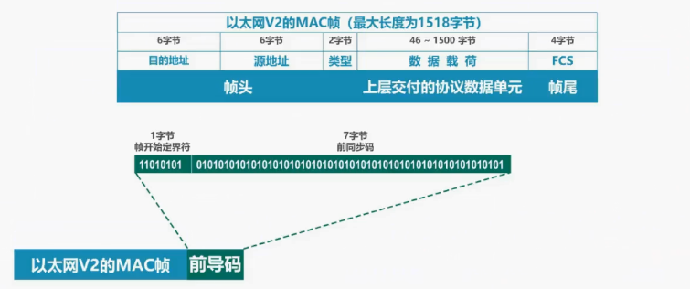
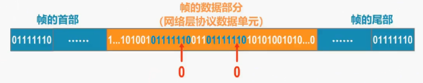
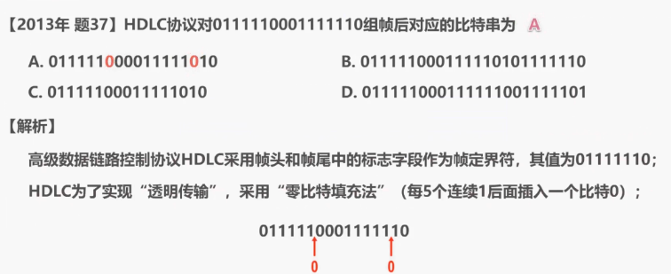

## 3.2 封装成帧

‍‍所谓封装成帧就是指数据链路层给上层交付下来的协议数据单元，添加帧头和帧尾，‍‍使之成为帧。

例如下图所示在帧头和帧尾中包含有重要的控制信息，例如‍‍这是以太网版本 2 的 MAC 帧格式，这是上层交付下来的协议数据单元，这是帧头，‍‍这是帧尾，这是点对点协议 PPP 的帧格式，这是上层交付下来的协议数据单元，这是帧头，‍‍这是帧尾。

发送方的数据链入层将上层交付下来的协议数据单元封装成帧后，还要通过物理层‍‍将构成帧的个比特转换成电信号，发送到传输媒体。‍‍那么接收方的数据链路层‍‍如何从物理层交付的比特流中提取出一个个的帧呢？例如‍‍这一串比特流是一个帧吗？这一串比特流是一个帧吗？实际上‍‍帧头和帧尾的作用之一就是帧定界。

例如这是 PPP 帧的格式，在其帧头和帧尾中‍‍各包含有一个长度为 1 字节的标志字段，其作用就是帧定界。假设发送方发送的是 PPP 帧，‍‍比特流中红色部分是帧定界标志，那么接收方的数据链路层就可以依据帧定界标志，‍‍从物理层交付的比特流中提取出一个个的帧

需要说明的是‍‍，并不是每一种数据链路层协议的帧都包含有帧定界标志。‍‍

例如这是以太网版本 2 的 MAC 帧格式，‍‍在其帧头和帧尾中并没有包含帧定界标志。那么接收方又是如何从物理层交付的比特流中‍‍提取出一个个的以太网帧？实际上以太网的数据链路层封装好 MAC 帧后将其交付给物理层，‍‍物理层会在 MAC 帧前面添加八字节的前导码，然后再将比特流转换成电信号发送‍‍。前导码中的前 7 个字节为‍‍前同步码，作用是使接收方的时钟同步，之后的 1 字节为帧开始定界符，‍‍表明其后面紧跟着的就是 MAC 帧。‍‍

另外以太网还规定了帧间间隔时间为‍‍96 比特的发送时间，因此 MAC 帧并不需要帧结束定界符，需要说明的是‍‍帧间间隔还有其他作用。‍‍我们在后续课程中再进行介绍。

&nbsp;

- - -

接下来我们介绍透明传输的问题，‍‍透明传输是指数据链路层对上层交付的传输数据并没有任何限制，就好像数据链路层不存在一样。‍‍我们来举例说明，这是发送方数据链路层收到其上层交付的协议数据单元，给其添加帧头‍‍和帧尾，使其成为帧。‍‍为了简单起见，我们只画出了帧头和帧尾中的帧定界标志，‍‍帧定界标志也就是一个特定数值。

请大家思考一下，如果在上层交付的协议数据单元中，‍‍恰好也包含了这个特定数值，接收方还能正确接收该帧吗？‍‍回答是否定的。如图所示，接收方在收到第一个帧定界标志时，认为这是帧的开始，‍‍这并没有错误。‍‍当接收方再次接收到帧定界标志时，会误认为帧结束了.

如果数据链路层不采取其他措施，来避免接收方对帧是否结束的误判，就不能称为透明传输。‍‍也就是说数据链入层对上层交付的协议数据单元有限制，其内容不能包含帧定界符，‍‍很显然这样的数据链路层没有什么使用价值。

实际上各种数据链路层协议一定会想办法来解决这个问题。‍‍例如在发送帧之前，‍‍对帧的数据部分进行扫描，每出现一个帧定界符，就在其前面插入一个转义字符，‍‍接收方数据链路层在物理层交付的比特流装提取帧，遇到第一个帧定界符时，认为这是帧的开始。‍‍当遇到转义字符时就知道其后面的一字节内容虽然与帧定界符相同，但它是数据，‍‍而不是帧定界符。

剔除转义字符后，将其后面的内容作为数据继续提取，‍‍对于这个转义字符也是相同的处理。‍‍当再次提取到帧定界符时，表明这是帧的结束。‍‍

&nbsp;

- - -

请大家再来思考一下这种情况。在上层交付给数据链路层的协议数据单元中，既包含了帧定界符，‍‍又包含了转义字符，应该怎么处理？

方法仍然是在发送帧之前对帧的数据部分进行扫描，‍‍每出现一个帧定界符或转义字符，‍‍就在其前面插入一个转义字符，需要说明的是转义字符是一种特殊的控制字符，‍‍其长度为一个字节，10 进制值为 27，而并不是 E、S 以及 C 这三个字符。‍‍我们刚刚介绍的是面向字节的物理链路，是用字节填充或称字符填充的方法‍‍来实现透明传输。‍‍

&nbsp;

对于面向比特的电路，应该使用比特填充的方法来实现透明传输。例如‍‍这是某个点对点协议的帧，‍‍这是帧的数据部分，这是帧的尾部。

为了简单起见，在帧手部和尾部中‍‍仅给出了帧定界标志，而未给出其他控制字段，而帧的数据部分出现了两个帧定界标志，‍‍但它们实际上是数据，而不是帧定界。‍‍在发送前可以采用 0 比特填充法，‍‍对数据部分进行扫描，每 5 个连续的比特 1 后面就插入 1 个比特 0，‍‍这样就确保了帧定界在整个帧中的唯一性，也就可以实现透明传输。接收方的数据链路层，‍‍从物理层交付的比特流中提取帧时，将帧的数据部分中的每 5 个连续的比特 1 后面的比特 0 剔除即可。‍‍

&nbsp;

接下来我们来做一个有关 0 比特填充的练习题，这是计算机专业考研全国统考‍‍计算机网络部分，2013 年的题 37。

题目中所给的高级数据链路控制协议 HDLC‍‍采用帧头和帧尾中的标志字段作为帧定界，旗帜为 01111110。‍‍Hdlc 为了实现透明传输，采用 0 比特填充法，也就是每 5 个连续 1 后面插入 1 个比特 0‍‍ 如下所示。因此选项 A 正确.

&nbsp;

最后还要提醒大家，为了提高帧的传输效率，‍‍应当使帧的数据部分的长度尽可能大一些。‍‍如图所示帧的数据部分的长度‍‍应远大于帧头和帧尾的程度，这样才能提高帧的传输效率。因为仅层数据链路层来看，‍‍帧的数据部分才是帧正要传输的数据，帧头和帧尾是为了实现数据链路层功能而额外添加的。‍‍当然了，考虑到差错控制等多种因素，每一种数据链路层协议都规定了帧的数据部分的长度上限，‍‍称为最大传送单元 MTU：

**小结:**

